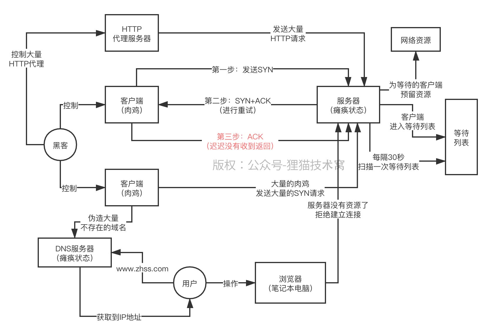

# 100、再来看看基于DNS Query Flood和HTTP Flood的DDoS攻击

这个DNS Query Flood攻击，顾名思义，就是去攻击DNS服务器，也就是伪造大量的域名解析请求发送给DNS服务器，然后DNS服务器必然没有，接着必然会去找上级DNS服务器，一直到根域名服务器

 

这么搞必然导致DNS服务器的资源别耗尽，其他正常人浏览网页也要解析域名的，此时就没法访问DNS服务器了

 

13.68.131.42

 

cc攻击，HTTP flood，其实就是之前说过的那种，直接就是在互联网上找到大量的HTTP代理，说白了，其实本身就有很多公司提供HTTP代理服务，自己搜一下就知道了，就是有很多代理服务器，你可以控制那些HTTP代理服务器去给目标服务器发送大量的HTTP请求

 

然后目标服务器直接肯定就挂了

 

Nginx、Tomcat、Jetty，机器上都是会部署Web服务器，都是一个进程，启动多个线程，来并发的处理各种HTTP请求

 

控制大量的肉鸡，控制大量的HTTP代理，TCP SYN Flood、DNS Query Flood、HTTP Flood，搞瘫痪你的服务器，或者DNS服务器，DDoS攻击，利用大量的机器进行分布式的海量请求发送，你的网站的服务不可用  
