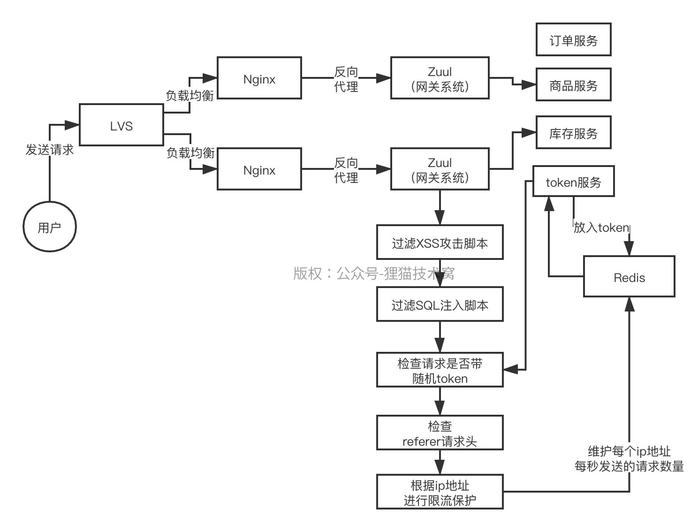
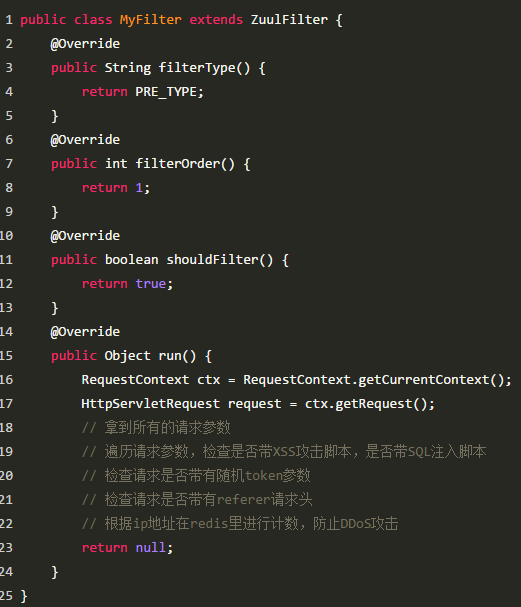

# 101、在分布式架构中，Zuul网关是如何防止网络攻击的？

XSS、CRSF、SQL注入、DDoS

 

XSS核心是设置cookie的http only属性，过滤脚本，CRSF也是设置cookie的http only属性，根据referer请求头来过滤，设置表单随机参数，SQL注入就是过滤恶意参数，DDoS攻击主要就是限流

 

zuul网关里加一个过滤器，过滤器里去过滤一些特殊请求的脚本，根据referer请求头过滤，对请求的随机token进行校验，甚至可以对参数进行校验，如果参数里包含SQL说明要注入，全部过滤，对ip地址可以进行基于redis的访问计数，比如说一个ip地址一秒内连续访问5次，那么就直接禁止访问

