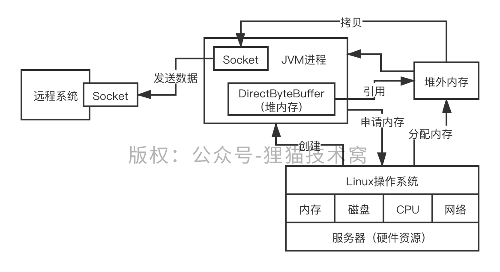

# 104、能说说你对堆外内存的理解吗？堆外内存的优势在哪里？

堆内和堆外的概念：堆内内存，heap，off-heap

 

硬件层面的内存，其实就是一根内存条而已，自己去购买内存条，在笔记本电脑里是可以装更多的内存条的，习惯于用32GB内存的笔记本电脑，买16GB内存，装在里面

 

如何用堆外内存？

 

ByteBuffer buffer = ByteBuffer.allocateDirect(1024); // 传入的是你要申请的堆外内存的大小

// 你可以直接把你的数据写入到内外内存DirectByteBuffer里去

// 把这块数据通过Socket发送，就是直接发送就可以了，不需要走一个拷贝

 

堆外内存的优势？堆内的数据，要网络IO写出去，要先拷贝到堆外内存，再写入到socket里发送出去；如果直接数据分配在堆外内存，是不需要有一次额外的拷贝的，性能是比较高的

 

读写文件也是同理的，都可以节约数据拷贝次数

 

1、如果堆外内存足够，就直接预留一部分内存

2、如果堆外内存不足，则将已经被 JVM 垃圾回收的 DirectBuffer 对象的堆外内存释放

3、如果进行一次堆外内存资源回收后，还不够进行本次堆外内存分配的话，则进行 System.gc()

4、如果 9 次尝试后依旧没有足够的可用堆外内存，则抛异常。

 

 -XX:MaxDirectMemorySize
