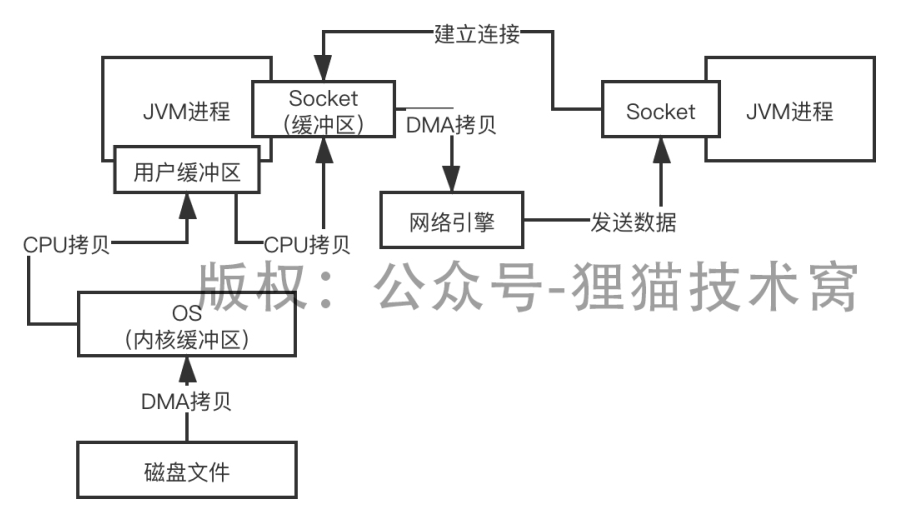
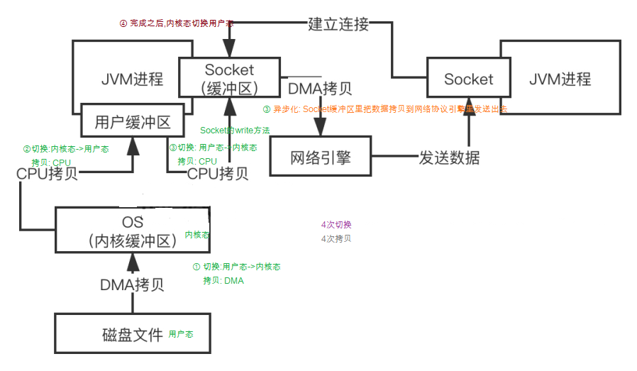

# 106、如果不使用零拷贝技术，普通的IO操作在OS层面是如何执行的？





```text
File file = new File("xxx.txt");        
RandomAccessFile raf = new RandomAccessFile(file, "rw");         

byte[] arr = new byte[(int) file.length()];        
# read读取数据,用户态切换内核态
raf.read(arr);   


Socket socket = new ServerSocket(8080).accept();        
# 
socket.getOutputStream().write(arr);
```

1) 内核态切换到用户态
    使用read读取数据的时候，会有一次用户态到内核态的切换，也就是说从用户角度切换到了内核角度去执行，这个时候基于DMA引擎把磁盘上的数据拷贝到内核缓冲里去；

2) 内核态切换到用户态
    接着会从内核态切换到用户态，基于CPU把内核缓冲里的数据拷贝到用户缓冲区里去

3) 用户态切换到内核态
    接着我们调用了Socket的输出流的write方法，此时会从用户态切换到内核态，同时基于CPU把用户缓冲区里的数据拷贝到Socket缓冲区里去，接着会有一个异步化的过程，
    
    基于DMA引擎从Socket缓冲区里把数据拷贝到网络协议引擎里发送出去

4) 内核态切换回用户态
    都完成之后，从内核态切换回用户态

5) 总结

    所以说，从本地磁盘读取数据，到通过网络发送出去，用户态和内核态之间，要发生4次切换，这是其一；
    
    其二，数据从磁盘拿出来过后，一共要经过4次拷贝；
    
    所以说，这4次切换和4次拷贝，让普通的IO操作都性能较低
