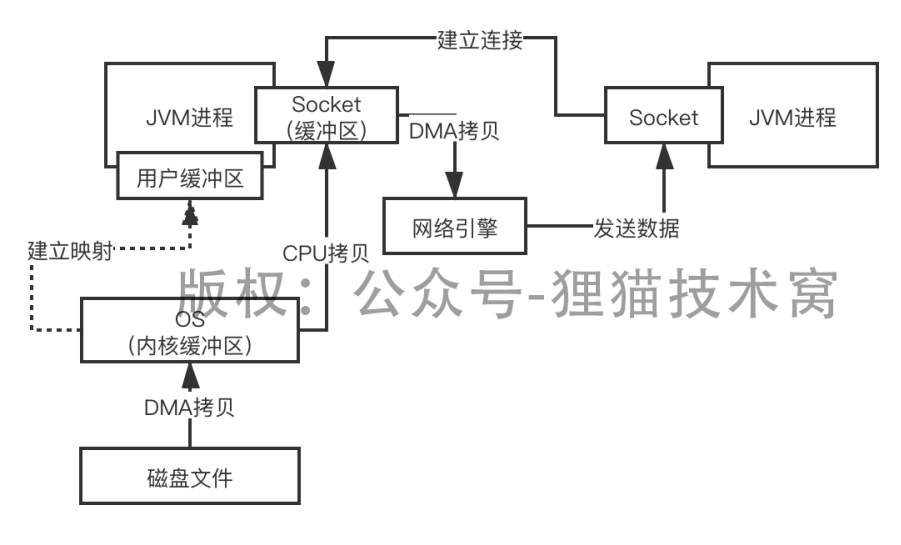

# 107、听说过mmap吗？内存映射技术为什么可以提升IO性能？

把**一个磁盘文件映射到内存里来**，然后把映射到内存里来的数据通过socket发送出去
 

有一种mmap技术，也就是内存映射，直接将磁盘文件数据映射到内核缓冲区，这个映射的过程是基于DMA引擎拷贝的，

同时用户缓冲区是跟内核缓冲区共享一块映射数据的，建立共享映射之后，就不需要从内核缓冲区拷贝到用户缓冲区了

光是这一点，就可以避免一次拷贝了，但是这个过程中还是会用户态切换到内核态去进行映射拷贝，接着再次从内核态切换到用户态，建立用户缓冲区和内核缓冲区的映射

接着把数据通过Socket发送出去，还是要再次切换到内核态

 

接着直接把内核缓冲区里的数据拷贝到Socket缓冲区里去，然后再拷贝到网络协议引擎里，发送出去就可以了，最后切换回用户态

 

**减少一次拷贝**，但是并不减少切换次数，一共是4次切换，3次拷贝

 

mmap技术是主要在RocketMQ里来使用的，公众号：儒猿技术窝，《从0开始带你成为消息中间件高手》的专栏，RocketMQ，里面剖析了一下，RocketMQ底层主要就是基于mmap技术来提升了磁盘文件的读写，性能
