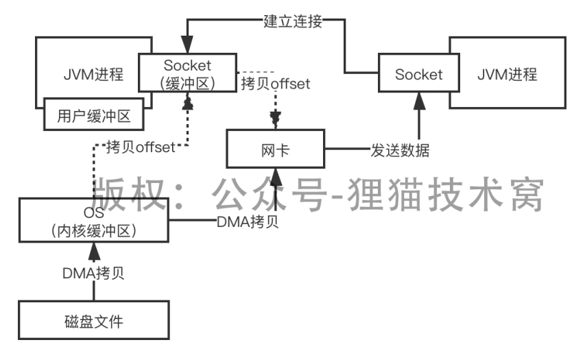

# 108、零拷贝技术到底是什么，他是如何提升IO性能的？

linux提供了sendfile，也就是零拷贝技术

 

在你的代码里面，如果说你基于零拷贝技术来读取磁盘文件，同时把读取到的数据通过Socket发送出去的话，流程如下，Kafka源码，transferFrom和transferTo两个方法，从磁盘上读取文件，把数据通过网络发送出去

 

这个零拷贝技术，就是先从用户态切换到内核态，在内核态的状态下，把磁盘上的数据拷贝到内核缓冲区，同时从内核缓冲区拷贝一些offset和length到Socket缓冲区；接着从内核态切换到用户态，从内核缓冲区直接把数据拷贝到网络协议引擎里去

 

同时从Socket缓冲区里拷贝一些offset和length到网络协议引擎里去，但是这个offset和length的量很少，几乎可以忽略

 

只要2次切换，2次拷贝，就可以了

 

kafka、tomcat，都是用的零拷贝技术，rocketmq用的是mmap技术，mmap还是要多2次切换和1次拷贝的，在Java代码中如何进行mmap和零拷贝，大家可以去看一看网上的一些资料

 

用户态和内核态，用户态空间，内核态空间
