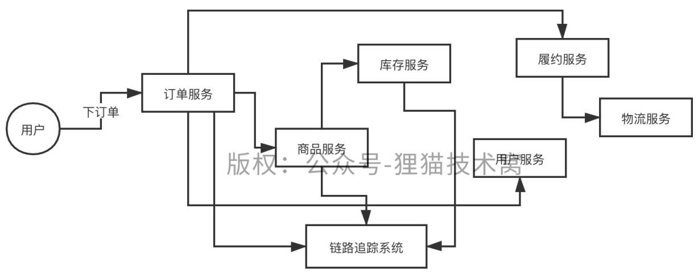

# 111、对分布式系统进行核心链路追踪的时候，链路id是怎么管理的？

每一个请求入口，traceid，每一次服务调用，spanid，上游服务id，parenetid，调用时间，timestamp，有正向的，还有反向的，把请求发出，请求接收，业务处理，各种时间都记录下来，计算网络耗时和业务处理耗时

 

底层的服务框架，接收到每一层请求调用的时候都要交给链路追踪系统的客户端框架来处理一下，traceid，代表了一次请求

链路追踪数据：

traceid=1，spanid=1，parentid=0，received_timestamp=12:00:00 300，send_timestamp=12:00:00 302

 

traceid=1，spanid=2，parentid=1，received_timestamp=12:00:00 303，send_timestamp=12:00:00 305

 

traceid=1，spanid=3，parentid=2，received_timestamp=12:00:00 306

 

traceid=1，spanid=3，parentid=2，send_timestamp=12:00:05 502

 

traceid=1，spanid=2，parentid=1，received_timestamp=12:00:05 503
