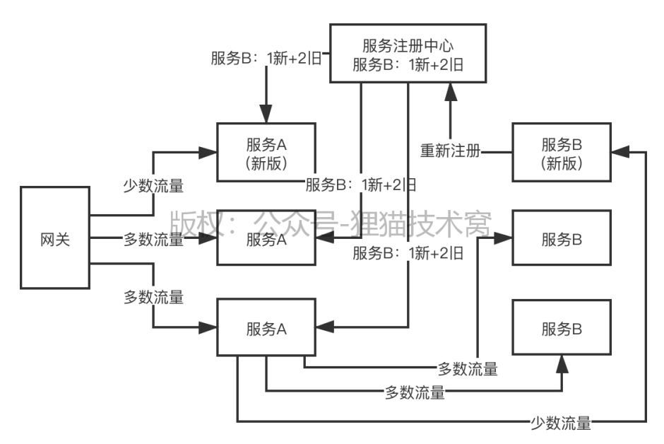
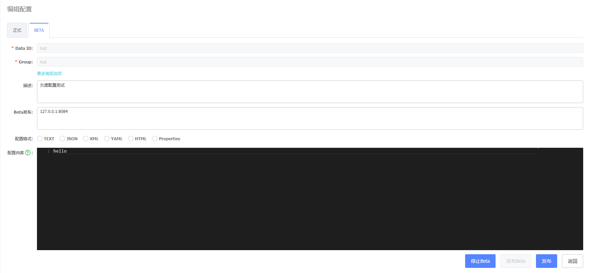

# 114、实施灰度发布的时候，网关是可以灰度了，可是Dubbo服务如何进行灰度呢？

spring cloud alibaba技术栈，nacos，nacos是企业级的服务注册中心，功能还是比较强大的，灰度发布这块都是可以做到的

------------------
个人笔记:

### nacos灰度发布

[Nepxion Discovery – 基于Nacos实现Spring Cloud灰度发布和路由](https://github.com/Nepxion/Discovery)

[基于springcloud gateway + nacos实现灰度发布（reactive版）](https://cloud.tencent.com/developer/article/1621304)
