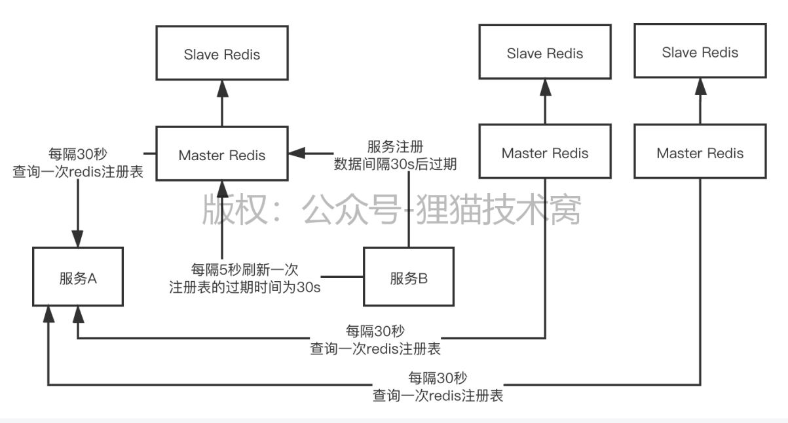

# 115、除了常见服务注册中心之外，你觉得Redis能作为服务注册中心吗？

redis里的hash数据结构，类似map的数据结构

 

约定好，你的服务注册的key都是：service_ORDER，service_PRODUCT，scan扫描指定的前缀开头的所有的key，一次性把注册表里的几十个到几百个服务都给扫描出来，获取到一个完整的注册表

 

基于Redis还可以做分布式服务注册中心，Redis Cluster，做一个集群
