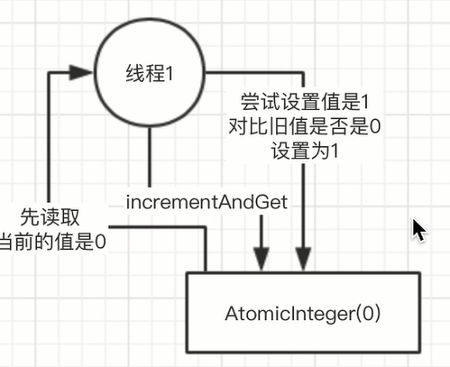
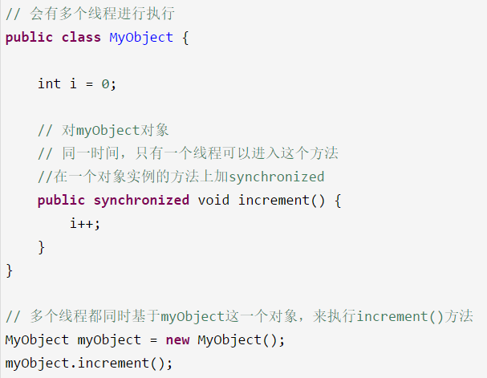
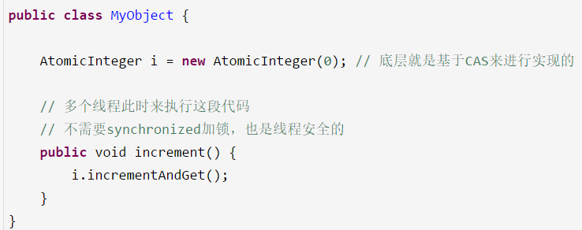

# 《13、能聊聊你对CAS的理解以及其底层实现原理可以吗？》（基础篇）

 
 
 
  
取值，询问，修改

 

多个线程他们可能要访问同一个数据

 

HashMap map = new HashMap();

 

此时有多个线程要同时读写类似上面的这种内存里的数据，此时必然出现多线程的并发安全问题，几个月培训班的同学，都应该知道

 

我们可能要用到并发包下面的很多技术，synchronized

synchronized(map) {

   // 对map里的数据进行复杂的读写处理

}

 

并发包下面的其他的一些技术

 

CAS

 

一段代码：

 
 
 此时，synchronized他的意思就是针对当前执行这个方法的myObject对象进行加锁
 
  
 
 只有一个线程可以成功的堆myObject加锁，可以对他关联的monitor的计数器去加1，加锁，一旦多个线程并发的去进行synchronized加锁，串行化，效率并不是太高，很多线程，都需要排队去执行
 
 
 
 CAS，compare and set
 
  
 
 CAS在底层的硬件级别给你保证一定是原子的，同一时间只有一个线程可以执行CAS，先比较再设置，其他的线程的CAS同时间去执行此时会失败