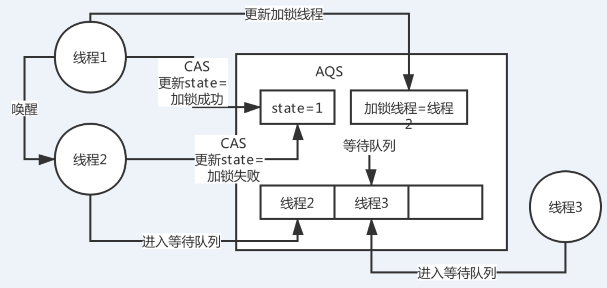

#  《15、你对JDK中的AQS理解吗？AQS的实现原理是什么？》

ReentrantLock

 

state变量 -> CAS -> 失败后进入队列等待 -> 释放锁后唤醒

 

非公平锁，公平锁

多线程同时访问一个共享数据，sychronized，CAS，ConcurrentHashMap（并发安全的数据结构可以来用），Lock

 

synchronized就有点不一样了，你可以自己上网看一下 => AQS，Abstract Queue Synchronizer，抽象队列同步器

 

Semaphore、其他一些的并发包下的

 

ReentrantLock lock = new ReentrantLock(true);  => 非公平锁

// 多个线程过来，都尝试

lock.lock();

lock.unlock();