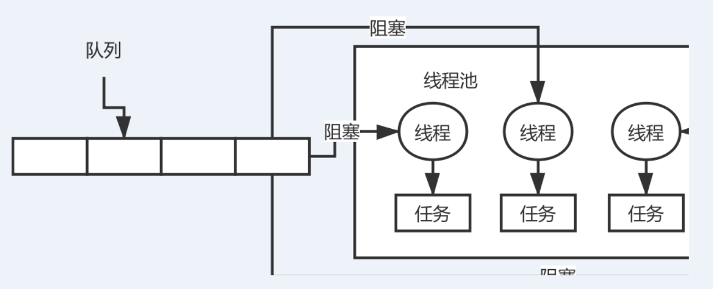

# 《16、说说线程池的底层工作原理可以吗？》

但凡是参加过几个月java就业培训的同学，都应该知道一个概念，线程池

 

系统是不可能说让他无限制的创建很多很多的线程的，会构建一个线程池，有一定数量的线程，让他们执行各种各样的任务，线程执行完任务之后，不要销毁掉自己，继续去等待执行下一个任务

 

频繁的创建线程，销毁线程，创建线程，销毁线程

 

ExecutorService threadPool = Executors.newFixedThreadPool(3) -> 3: corePoolSize

 

threadPool.submit(new Callable() {

       public void run() {}

})；

 

提交任务，先看一下线程池里的线程数量是否小于corePoolSize，也就是3，如果小于，直接创建一个线程出来执行你的任务

 

如果执行完你的任务之后，这个线程是不会死掉的，他会尝试从一个无界的LinkedBlockingQueue里获取新的任务，如果没有新的任务，此时就会阻塞住，等待新的任务到来

 

你持续提交任务，上述流程反复执行，只要线程池的线程数量小于corePoolSize，都会直接创建新线程来执行这个任务，执行完了就尝试从无界队列里获取任务，直到线程池里有corePoolSize个线程

 

接着再次提交任务，会发现线程数量已经跟corePoolSize一样大了，此时就直接把任务放入队列中就可以了，线程会争抢获取任务执行的，如果所有的线程此时都在执行任务，那么无界队列里的任务就可能会越来越多

 

fixed，队列，LinkedBlockingQueue，无界阻塞队列