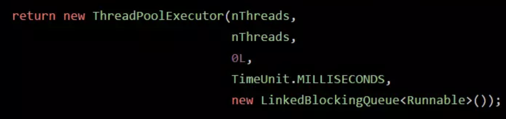

#  《17、那你再说说线程池的核心配置参数都是干什么的？平时我们应该怎么用？》
newFixedThreadPool(3)

 

 

代表线程池的类是ThreadPoolExecutor

 

创建一个线程池就是这样子的，corePoolSize，maximumPoolSize，keepAliveTime，queue，这几个东西，如果你不用fixed之类的线程池，自己完全可以通过这个构造函数就创建自己的线程池

 

corePoolSize：3

maximumPoolSize：Integer.MAX_VALUE

keepAliveTime：60s

new ArrayBlockingQueue<Runnable>(200)

 

如果说你把queue做成有界队列，比如说new ArrayBlockingQueue<Runnable>(200)，那么假设corePoolSize个线程都在繁忙的工作，大量任务进入有界队列，队列满了，此时怎么办？

 

这个时候假设你的maximumPoolSize是比corePoolSize大的，此时会继续创建额外的线程放入线程池里，来处理这些任务，然后超过corePoolSize数量的线程如果处理完了一个任务也会尝试从队列里去获取任务来执行

 

如果额外线程都创建完了去处理任务，队列还是满的，此时还有新的任务来怎么办？

只能reject掉，他有几种reject策略，可以传入RejectedExecutionHandler

 

(1)AbortPolicy  

(2)DiscardPolicy  

(3)DiscardOldestPolicy 

(4)CallerRunsPolicy  

(5)自定义

 

如果后续慢慢的队列里没任务了，线程空闲了，超过corePoolSize的线程会自动释放掉，在keepAliveTime之后就会释放

 

根据上述原理去定制自己的线程池，考虑到corePoolSize的数量，队列类型，最大线程数量，拒绝策略，线程释放时间

 

一般比较常用的是：fixed线程，