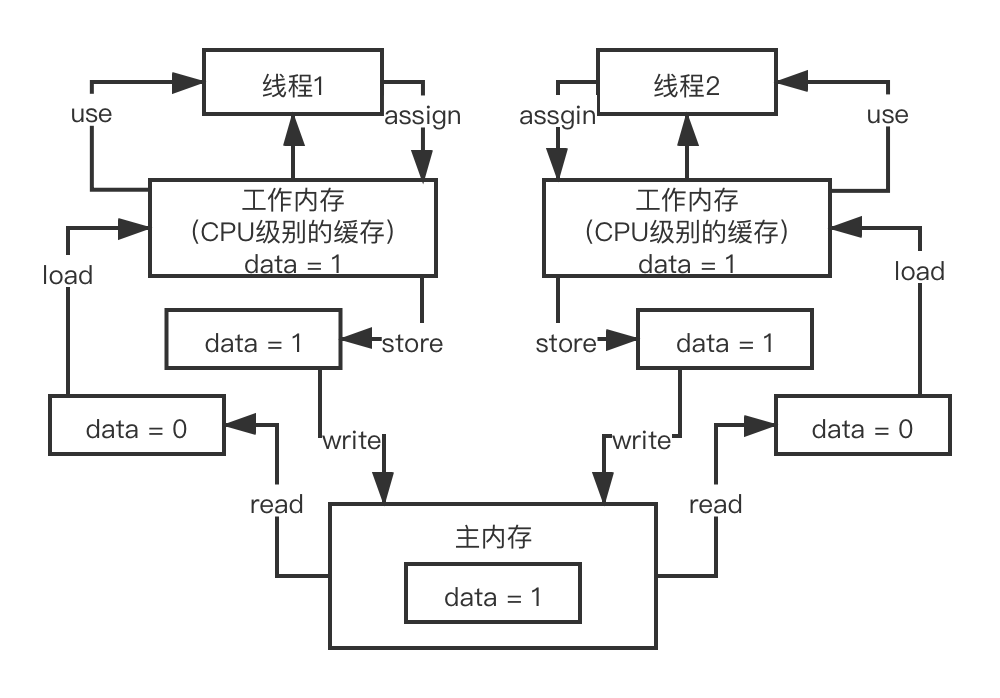
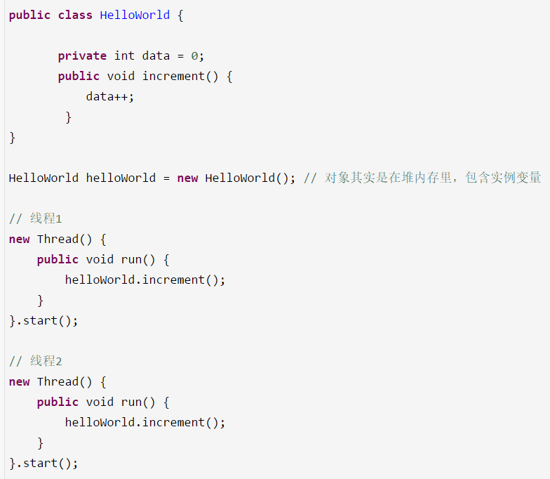

# 21、谈谈你对Java内存模型的理解可以吗？

read、load、use、assign、store、write

 

后台留言，并发这块讲解的好像有的地方有点浅，面试突击第一季和第二季，面试突击第一季，扫盲的作用，对并发、mysql、网络比较基础的知识，常见的面试题，根本就不太了解，4个月的培训班里出来的

 

直接楞住了，说，不好意思，concurrenthashmap从来没用过，crud 

