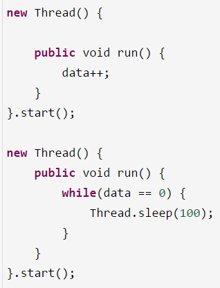
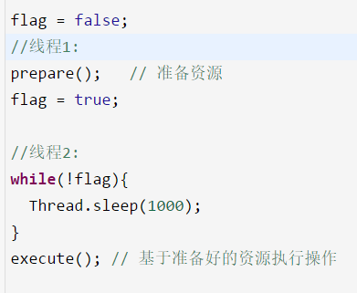

#  22、你知道Java内存模型中的原子性、有序性、可见性是什么吗？
连环炮：Java内存模型 -> 原子性、可见性、有序性 -> volatile -> happens-before / 内存屏障

 

也就是并发编程过程中，可能会产生的三类问题

 

（1）可见性

 

之前一直给大家代码演示，画图演示，其实说的就是并发编程中可见性问题

 

没有可见性，有可见性

 

 

（2）原子性

 

有原子性，没有原子性

 

原子性：data++，必须是独立执行的，没有人影响我的，一定是我自己执行成功之后，别人才能来进行下一次data++的执行

 

（3）有序性

 

对于代码，同时还有一个问题是指令重排序，编译器和指令器，有的时候为了提高代码执行效率，会将指令重排序，就是说比如下面的代码

 

具备有序性，不会发生指令重排导致我们的代码异常；不具备有序性，可能会发生一些指令重排，导致代码可能会出现一些问题

 

 

重排序之后，让flag = true先执行了，会导致线程2直接跳过while等待，执行某段代码，结果prepare()方法还没执行，资源还没准备好呢，此时就会导致代码逻辑出现异常。

