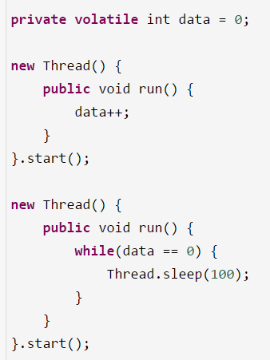

# 23、能聊聊volatile关键字的原理吗？
内存模型 -> 原子性、可见性、有序性 -> volatile

 

讲清楚volatile关键字，直接问你volatile关键字的理解，对前面的一些问题，这个时候你就应该自己去主动从内存模型开始讲起，原子性、可见性、有序性的理解，volatile关键字的原理

 

volatile关键字是用来解决可见性和有序性，在有些罕见的条件之下，可以有限的保证原子性，他主要不是用来保证原子性的

可见性，概念进行了加强和深化，volatile在可见性上的作用和原理，有一个很清晰的了解

 

在很多的开源中间件系统的源码里，大量的使用了volatile，每一个开源中间件系统，或者是大数据系统，都多线程并发，volatile

