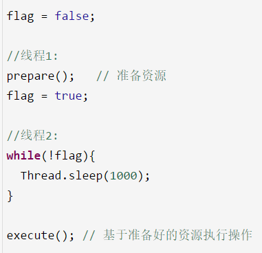
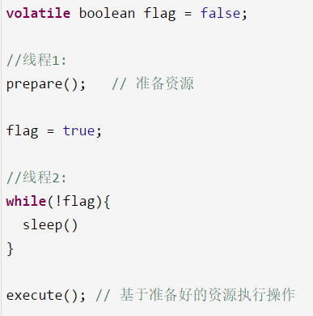
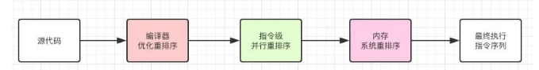

# 24、你知道指令重排以及happens-before原则是什么吗？
volatile关键字和有序性的关系，`volatile`是如何保证有序性的，如何避免发生指令重排的

java中有一个`happens-before`原则：

编译器、指令器可能对代码重排序，乱排，要守一定的规则，happens-before原则，只要符合happens-before的原则，那么就不能胡乱重排，如果不符合这些规则的话，那就可以自己排序

* 1、程序次序规则：一个线程内，按照代码顺序，书写在前面的操作先行发生于书写在后面的操作

* 2、锁定规则：一个unLock操作先行发生于后面对同一个锁的lock操作，比如说在代码里有先对一个lock.lock()，lock.unlock()，lock.lock()

* 3、volatile变量规则：对一个volatile变量的写操作先行发生于后面对这个volatile变量的读操作，volatile变量写，再是读，必须保证是先写，再读

* 4、传递规则：如果操作A先行发生于操作B，而操作B又先行发生于操作C，则可以得出操作A先行发生于操作C

* 5、线程启动规则：Thread对象的start()方法先行发生于此线程的每个一个动作，thread.start()，thread.interrupt()

* 6、线程中断规则：对线程interrupt()方法的调用先行发生于被中断线程的代码检测到中断事件的发生

* 7、线程终结规则：线程中所有的操作都先行发生于线程的终止检测，我们可以通过Thread.join()方法结束、Thread.isAlive()的返回值手段检测到线程已经终止执行

* 8、对象终结规则：一个对象的初始化完成先行发生于他的finalize()方法的开始

上面这8条原则的意思很显而易见，就是程序中的代码如果满足这个条件，就一定会按照这个规则来保证指令的顺序。

 

很多同学说：好像没听懂，模模糊糊，这些规则写的非常的拗口，晦涩难懂，在面试的时候比如面试官问你，happens-before原则，你必须把8条规则都背出来，反问，没有任何一个人可以随意把这个规则背出来的

规则制定了在一些特殊情况下，不允许编译器、指令器对你写的代码进行指令重排，必须保证你的代码的有序性

但是如果没满足上面的规则，那么就可能会出现指令重排，就这个意思。

这8条原则是避免说出现乱七八糟扰乱秩序的指令重排，要求是这几个重要的场景下，比如是按照顺序来，但是8条规则之外，可以随意重排指令。

比如这个例子，如果用volatile来修饰flag变量，一定可以让prepare()指令在flag = true之前先执行，这就禁止了指令重排。

因为volatile要求的是，volatile前面的代码一定不能指令重排到volatile变量操作后面，volatile后面的代码也不能指令重排到volatile前面。

指令重排 -> happens-before -> volatile起到避免指令重排

---------------------
个人笔记

1. 什么是重排序?
为了提高性能,编译器和处理器常常会对既定的代码执行顺序进行指令重排序。

2. 重排序的类型有哪些呢？源码到最终执行会经过哪些重排序呢？

 在不改变程序执行结果的前提下，尽可能提高执行效率。

* 编译器优化的重排序。编译器在不改变单线程程序语义的前提下，可以重新安排语句的执行顺序;
* 指令级并行的重排序。现代处理器采用了指令级并行技术来将多条指令重叠执行。如果不存在数据依赖性，处理器可以改变语句对应机器指令的执行顺序;
* 内存系统的重排序。由于处理器使用缓存和读/写缓冲区，这使得加载和存储操作看上去可能是在乱序执行的。

3. `happens-before`在什么情况下不进行指令重排
