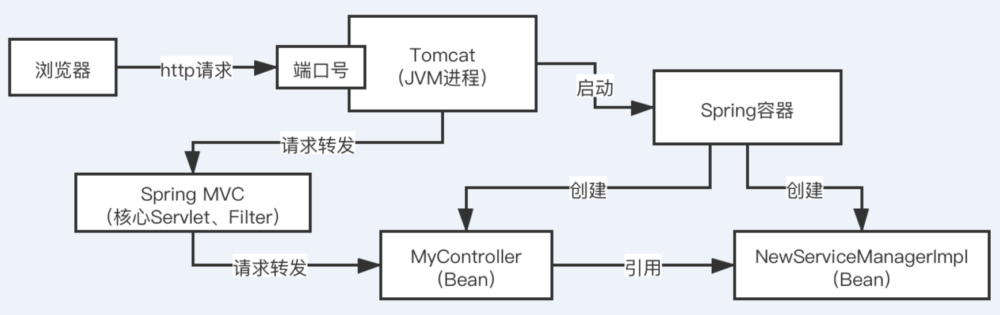
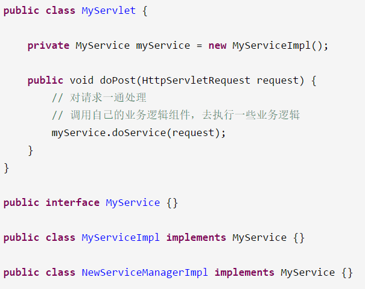
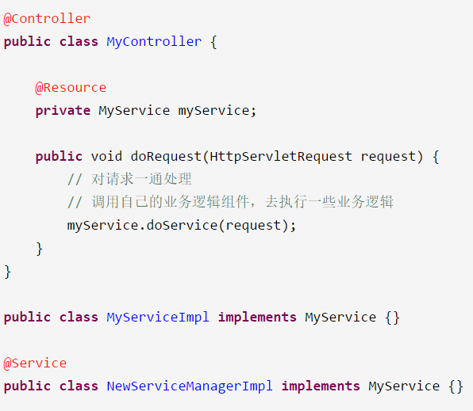

# 《26、说说你对Spring的IOC机制和AOP机制的理解可以吗？》

集合的面试题，并发的面试题，你在写代码的时候，必然都是会去用到集合包下的API，并发包下的API，基本功，你对Java最基础的一些技术和API的理解，决定了你能不能用好Java这门语言，去写好对应的程序

 

太过分了

 

spring这块的面试题，spring boot，spring cloud，spring web mvc

 

互联网行业，传统软件行业，技术栈里面一般来说都是以spring框架为核心的，一定是用一大堆的框架，上来哐哐哐，整合一下框架，然后完全就是基于框架来做一些crud，增删改查的业务功能的实现

 

spring ioc

 

写一套系统，web服务器，tomcat，一旦启动之后，他就可以监听一个端口号的http请求，然后可以把请求转交给你的servlet，jsp，配合起来使用的，servlet处理请求

 

比如在我们的一个tomcat+servlet的这样的一个很low的系统里，有几十个地方，都是直接用MyService myService = new MyServiceImpl()，直接创建、引用和依赖了一个MyServiceImpl这样的一个类的对象。

 

我们这个low系统里，有几十个地方，都跟MyServiceImpl类直接耦合在一起了

 

我现在不想要用MyServiceImpl了，我们希望用的是NewServiceManagerImpl，implements MyService这个接口的，所有的实现逻辑都不同了，此时我们很麻烦，我们需要在很low的系统里，几十个地方，都去修改对应的MyServiceImpl这个类，切换为NewServiceManagerImpl这个类

 

改动代码成本很大，改动完以后的测试的成本很大，改动的过程中可能很复杂，出现一些bug，此时就会很痛苦，归根结底，代码里，各种类之间完全耦合在一起，出现任何一丁点的变动，都需要改动大量的代码，重新测试，可能还会有bug

 

Spring IOC框架，控制反转，依赖注入

 

xml文件来进行一个配置，进化到了基于注解来进行自动依赖注入

 

我们只要在这个工程里通过maven引入一些spring框架的依赖，ioc功能

 

tomcat在启动的时候，直接会启动spring容器

 

spring ioc，spring容器，根据xml配置，或者是你的注解，去实例化你的一些bean对象，然后根据xml配置或者注解，去对bean对象之间的引用关系，去进行依赖注入，某个bean依赖了另外一个bean

 

底层的核心技术，反射，他会通过反射的技术，直接根据你的类去自己构建对应的对象出来，用的就是反射技术

 

spring ioc，系统的类与类之间彻底的解耦合

 

现在这套比较高大上的一点系统里，有几十个类都使用了@Resource这个注解去标注MyService myService，几十个地方都依赖了这个类，如果要修改实现类为NewServiceManagerImpl