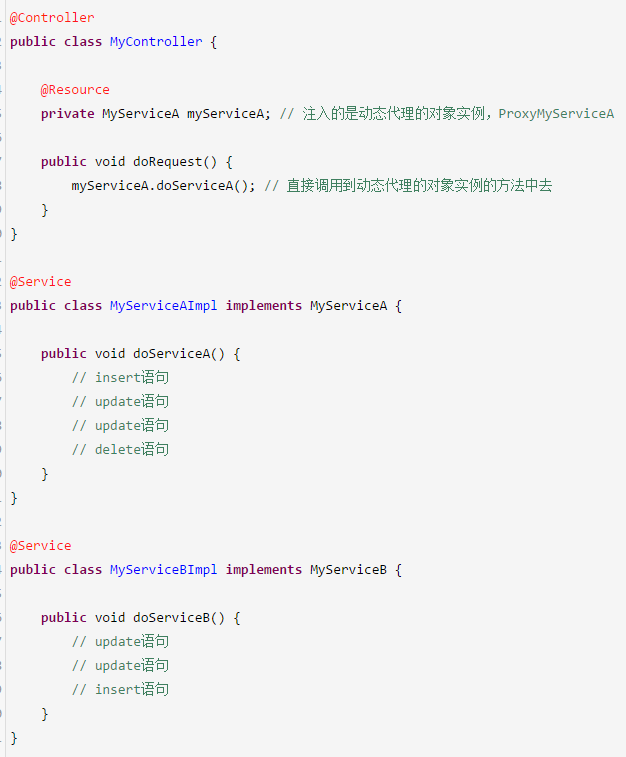
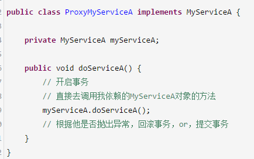

#  27、说说你对Spring的AOP机制的理解可以吗？
spring核心框架里面，最关键的两个机制，就是ioc和aop，根据xml配置或者注解，去实例化我们所有的bean，管理bean之间的依赖注入，让类与类之间解耦，维护代码的时候可以更加的轻松便利

 

spring已经管理了我们代码里所有的这个类的对象实例，bean

我们有几十个Service组件，类似的一样的代码，重复的代码，必须在几十个地方都去写一模一样的东西

 

spring aop机制出马了

 

他有几个概念，可以做一个切面，语法、用法、术语和概念，完整、详细的了解，上网再去搜一些资料

 

做一个切面，如何定义呢？MyServiceXXXX的这种类，在这些类的所有方法中，都去织入一些代码，在所有这些方法刚开始运行的时候，都先去开启一个事务，在所有这些方法运行完毕之后，去根据是否抛出异常来判断一下，如果抛出异常，就回滚事务，如果没有异常，就提交事务 => AOP

 

面向切面编程，Aspect

 

建议大家看完这个视频，自己百度一下，spring aop代码示例，基于spring aop，切面如何来做，如何来定义增强的代码，如何来限定对哪些类的哪些方法进行增强

 

spring在运行的时候，动态代理技术，AOP的核心技术，就是动态代理

 

他会给你的那些类生成动态代理

 

事务，mysql，数据库里都提供一个事务机制，我们如果开启一个事务，在这个事务里执行多条增删改的sql语句，这个过程中，如果任何一个sql语句失败了，会导致这个事务的回滚，把其他sql做的数据更改都恢复回去

 

在一个事务里的所有sql，要么一起成功，要么一起失败，事务功能可以保证我们的数据的一致性，在业务逻辑组件里去加入这个事务