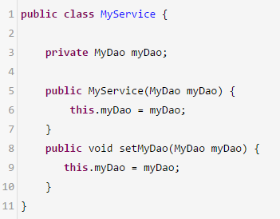

# 《32、额外加餐：能画一张图说说Spring的核心架构吗？》
spring核心源码，spring核心架构图，里面包含了各种类和API之间的调用，引入一个别的点，把spring的核心的东西再梳理一下

 

spring bean生命周期，从创建 -> 使用 -> 销毁

 

你在系统里用xml或者注解，定义一大堆的bean

 

（1）实例化Bean：如果要使用一个bean的话

 

（2）设置对象属性（依赖注入）：他需要去看看，你的这个bean依赖了谁，把你依赖的bean也创建出来，给你进行一个注入，比如说通过构造函数，setter

 

（3）处理Aware接口：

 

如果这个Bean已经实现了ApplicationContextAware接口，spring容器就会调用我们的bean的setApplicationContext(ApplicationContext)方法，传入Spring上下文，把spring容器给传递给这个bean

 

（4）BeanPostProcessor：

 

如果我们想在bean实例构建好了之后，此时在这个时间带你，我们想要对Bean进行一些自定义的处理，那么可以让Bean实现了BeanPostProcessor接口，那将会调用postProcessBeforeInitialization(Object obj, String s)方法。

 

（5）InitializingBean 与 init-method：

 

如果Bean在Spring配置文件中配置了 init-method 属性，则会自动调用其配置的初始化方法。

 

（6）如果这个Bean实现了BeanPostProcessor接口，将会调用postProcessAfterInitialization(Object obj, String s)方法

 

（7）DisposableBean：

 

当Bean不再需要时，会经过清理阶段，如果Bean实现了DisposableBean这个接口，会调用其实现的destroy()方法；

 

（8）destroy-method：

 

最后，如果这个Bean的Spring配置中配置了destroy-method属性，会自动调用其配置的销毁方法。

创建+初始化一个bean -> spring容器管理的bean长期存活 -> 销毁bean（两个回调函数）