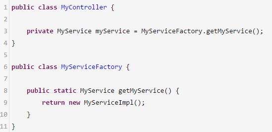

# 《33、能说说Spring中都使用了哪些设计模式吗？》
工厂，单例，代理

 

不可能有任何的技术深度，面试突击第二季里，我尝试着做了一些技术深度的讲解，但是我觉得还是很困难，只能稍微给你讲解一些原理

 

Spring源码底层去看，很多种设计模式的一个运用

 

工厂模式，单例模式，代理模式

 

工厂模式，spring ioc核心的设计模式的思想提现，他自己就是一个大的工厂，把所有的bean实例都给放在了spring容器里（大工厂），如果你要使用bean，就找spring容器就可以了，你自己不用创建对象了

 

 

spring默认来说，对每个bean走的都是一个单例模式，确保说你的一个类在系统运行期间只有一个实例对象，只有一个bean，用到了一个单例模式的思想，保证了每个bean都是单例的

 

稍微还算是有点含金量的

 

如果说你要对一些类的方法切入一些增强的代码，会创建一些动态代理的对象，让你对那些目标对象的访问，先经过动态代理对象，动态代理对象先做一些增强的代码，调用你的目标对象

 

在设计模式里，就是一个代理模式的体现和运用，让动态代理的对象，去代理了你的目标对象，在这个过程中做一些增强的访问，你可以把面试突击的内容作为一个抛砖引玉的作用，去更加深入的学习一些技术