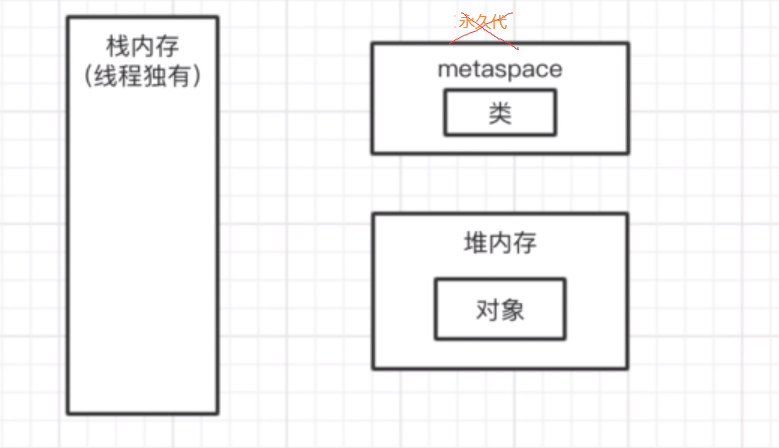

# 36、JVM中有哪几块内存区域？Java 8之后对内存分代做了什么改进？

集合、并发、spring框架，期待着我对这些基础的东西做一些很深入的，很牛X的讲解，基于框架写一些代码，完事儿了之后，就会把代码进行一个部署，一般来说是通过tomcat、jetty来部署java web系统

 

tomcat部署，tomcat自己就是基于java来开发的，我们启动的不是自己的系统，是一个tomcat是一个jvm进程，我们写的系统只不过是一些代码，放在tomcat的目录里，tomcat会去加载我们的代码到jvm里去

 

tomcat去负责接收请求，执行我们写好的代码，基于spring框架的一大堆代码

 

儒猿技术窝，有我好朋友写的《从0开始带你成为JVM实战高手》

 

面试突击第三季的定位，在10讲的jvm内容，会带着大家把jvm最最基础和最最常用的一些概念和原理，过一遍，起到一个复习的作用，起到一个抛砖引玉的效果，会给大家植入一些硬广，jvm那个专栏的一些内容的介绍

 

跟面试常问的一些思路结合起来，让大家可以站在面试的角度去思考一下，jvm平时面试会怎么来问呢，如何为了面试去好好准备jvm的东西呢

 

执行我们的一些对象的方法，执行代码的时候肯定会有很多的线程，tomcat里就有很多自己的工作线程，去执行我们写的代码，每个工作线程都会有自己的一块数据结构，栈内存，这个里面是存放一些东西

 

**java 8以后的内存分代的改进，永久代里放了一些常量池+类信息，常量池 -> 堆里面，类信息 -> metaspace（元区域）**

元数据区取代了永久代,两者类似,都是对JVM规范中方法区的实现,元数据空间不在虚拟机中，而是使用本地内存

[JVM的内存区域划分(jdk7和jdk8)](https://blog.csdn.net/l1394049664/article/details/81486470)
