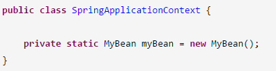

# 《38、说说JVM在哪些情况下会触发垃圾回收可以吗？》
我们的jvm的内存其实是有限制的，不可能是无限的，昂贵的资源，2核4G的机器，堆内存也就2GB左右，4核8G的机器，堆内存可能也就4G左右，栈内存也需要空间，metaspace区域放类信息也需要空间

 

在jvm里必然是有一个内存分代模型，年轻代和老年代

 

比如说给年轻代一共是2GB内存，给老年代是2GB内存，默认情况下eden和2个s的比例：8:1:1，eden是1.6GB，S是0.2GB

 

如果说eden区域满了，此时必然触发垃圾回收，young gc，ygc，谁是可以回收的垃圾对象呢？就是没有人引用的对象就是垃圾对象

