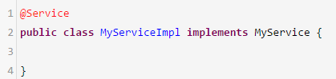

# 39、说说JVM的年轻代垃圾回收算法？对象什么时候转移到老年代？

如果说你让代码一边运行，一边有变动，一边判断哪些对象是可以回收的，这个是不现实的，垃圾回收的时候有一个概念，叫做stop the world，停止你的jvm里的工作线程的运行，然后扫描所有的对象，判断哪些可以回收，哪些不可以回收的

 

年轻代，大部分情况下，对象生存周期是很短的，可能在0.01ms之内，线程执行了3个方法，创建了几个对象，0.01ms之后就方法都执行结束了，此时那几个对象就会在0.01ms之内变成垃圾，可以回收的

 

100个对象，可能90个对象都是垃圾对象，10个对象是存活的对象，5个

 

复制算法，一次young gc，年轻代的垃圾回收

 

三种场景，第一种场景，有的对象在年轻代里熬过了很多次垃圾回收，15次垃圾回收，此时会认为这个对象是要长期存活的对象

 

Spring容器里，对每个bean实例对象就一个，长期存活，一直给我们来使用
