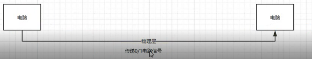
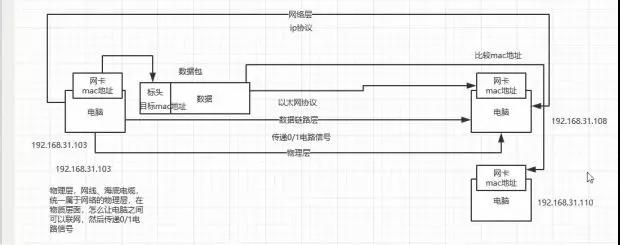
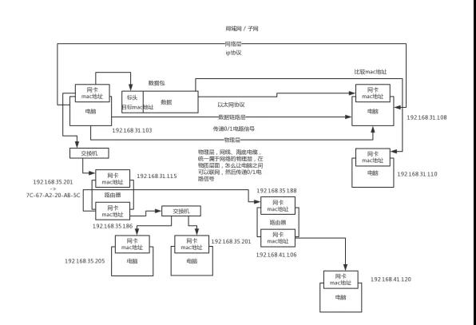

# 44_你能聊聊TCP/IP四层网络模型吗？OSI七层网络模型也说一下！(上)

## 一、面试真题
你能聊聊TCP/IP 的四层网络模型和 OSI 七层网络模型吗？

## 二、面试官心理分析
为啥要问这个？
 
坦白讲，一些大的公司，计算机基础必面，尤其是针对薪资30k以内的工程师，因为薪资30k以内，你还是要干活儿的吧，还没上升到就设计架构就可以的程度吧，你还没到那个高度吧。
 
所以只要你干活儿，你就不可避免要跟机器、网络、cpu、磁盘、内存，成天打交道。而线上系统，计算基础的一些东西，网络、cpu、磁盘、内存，都是关联很大的，比如说你线上系统会不会因为网络故障导致一些问题？cpu负载达到100%了咋办？磁盘读写很慢快满了咋办？内存使用率过高咋办？
 
你起码得有一套自己的计算机功底去支撑你玩儿线上系统吧。所以很多人呢，都说计算机基础没啥用，那这个话呢，也对，也不对。对就在于，你如果毕业出来干简单的crud，这些东西你确实不需要；不对就在于，你如果当个高工，带几个小弟干高并发有压力的线上系统，机器负载很高，很容易出问题，结果你连机器都不敢摸，或者也不知道怎么摸，那不是尴尬了么。
 
所以说，计算机基础，网络、磁盘、cpu、内存，还是得会一点儿基础的
 
作为一个大公司的面试官，一定会考察你这些东西

## 正餐开始——面试题剖析
首先要说一下，四层模型和七层模型，我们往往是可以一块儿来聊的。
 
（1）首先我问要明白，为啥要有协议
 
设想一下，各个电脑厂商，比如IBM、苹果啥的，都弄自己的协议，结果就苹果电脑和苹果电脑自己可以通信，和IBM电脑就不可以通信，这不是尴尬么。所以搞一个国际通行的协议，大家都按照这个来，所有电脑都可以通信，不是很好么。
 
此时就必须搞一个标准的网络模型出来，大家都按照这个来走，大家都要遵守统一的规范。这就是所谓OSI七层模型，他们分别是：应用层、表示层、会话层、传输层、网络层、数据链路层、物理层。那么在这个基础上，又简化出了TCP/IP四层模型，数据链路层、网络层、传输层、应用层。

那么每一层代表的是啥，我一一给大家讲解
 
（2）从底向上的网络分层
 
1）物理层
 
物理层，物理层干啥的，就是电脑之间要联网，一般咋弄？类似于说，你有台电脑，现在要联网，咋联？以前N年前，大家记不记得都是在电脑上插根线是吧，然后才能上网，结果现在就是联个wifi就行了，还有中国美国之前联网靠的是海底的光缆。所以物理层就指的这个，就是怎么把各个电脑给联结起来，形成一个网络，这就是物理层的含义，物理层负责传输0和1的电路信号。学过一些计算机的同学，计算机的最最底层，就是0/1，电信号。如下图：

2）数据链路层
 
数据链路层，物理层给各个电脑连接起来了，还传输最底层的0和1电路信号，关键不行啊，你得定义清楚哪些0和1分为一组，这些信号啥意思？这才能进行通信。所以数据链路层就干这事儿，定义一下电路信号咋分组。
 
00000011（从电脑1出发，要到电脑2去）
 
 00101（从电脑1出发，要到电脑3去）
 
 0101（从电脑2触发，要到电脑4去）
 
 01（从电脑3出发，要到电脑5去）
 
很多年前，每个公司都定义自己的电路信号分组方式，但是后来出来了以太网协议，以太网。一组电信号是一个数据包，叫一个帧（frame），每个帧分成两个部分，标头（head）和数据（data），标头包含一些说明性的东西，比如说发送者、接收者和数据类型之类的。
 
每台电脑要往另外一台电脑发送数据，一堆0/1电路信号，封装成数据包，包含头和数据，头里包含了从哪儿来到哪儿去，必须从一台电脑的一个网卡，发送到另外一个电脑的一个网卡，所以以太网发送的数据包必须得指定，目标电脑的网卡的mac地址。
 
以太网规定了，每个网卡必须得包含一个mac地址，mac地址就是这个网卡的唯一标识，
 
以太网协议规定了，接入网络里的所有设备，都得有个网卡，以太网协议里的那个数据包，在数据链路层传输的数据包，必须从一个电脑的网卡传输到另外一个电脑的网卡，而这个网卡地址就叫做所谓的mac地址。每块网卡出厂的时候，就有一个唯一的mac地址，48位的二进制，但是一般用12个16进制数字表示，前6个16进制是厂商编号，后6个16进制是网卡流水号。
 
windows上，ipconfig /all，看看物理地址，就是mac地址，7C-67-A2-20-AB-5C
 
所以在以太网里传输数据包的时候，必须指定接收者的mac地址才能传输数据。
 
但是以太网的数据包怎么从一个mac地址发送到另一个mac地址？这个不是精准推送的，以太网里面，如果一个电脑发个数据包出去，会广播给局域网内的所有电脑设备的网卡，然后每台电脑都从数据包里获取接收者的mac地址，跟自己的mac地址对比一下，如果一样，就说明这是发给自己的数据包。
 
但是上面这种广播的方式，仅仅针对一个子网（局域网）内的电脑，会广播，否则一个电脑不能广播数据包给全世界所有的其他电脑吧，是仅仅广播给一个子网里面的电脑的。

如下图：

3）网络层
 
上面说到，子网内的电脑，通过以太网发个数据包，对局域网内的电脑，是广播出去的。那么怎么知道哪些电脑在一个子网内呢？这就得靠网络层了，这里就有一套IP地址，IP地址就可以让我们区分哪些电脑是一个子网的。
 
网络层里有IP协议，IP协议定义的地址就叫做IP地址。IP地址有IPv4和IPv6两个版本，目前广泛使用的是IPv4，是32个二进制数字组成的，但是一般用4个十进制数字表示，范围从0.0.0.0到255.255.255.255之间。
 
每台计算机，都会分配一个ip地址，ip地址的前24位（就是前面3个十进制数字），代表了网络，后8位（就是最后1个十进制数字），代表了主机。

如果几台电脑是一个子网的，那么前面的3个十进制数字一定是一样的。举个例子，大家平时做实验，玩儿虚拟机吧，自己win上开几个linux虚拟机，你会发现，win上的ip地址可能是192.168.0.103，然后几个虚拟机的ip地址是192.168.0.182，192.168.0.125，192.168.0.106，类似这样的。

这个win机器和几个虚拟机，前面3个十进制数字都是192.168.0，就代表大家是一个子网内的，最后那个数字是这个子网的不同主机的编号。
 
但是实际上上面就是举个例子，其实单单从ip地址是看不出来哪些机器是一个子网的，因为从10进制是判断不出来的。需要通过ip地址的二进制来判断，结合一个概念来判断，叫做子网掩码。

比如说ip地址是192.168.56.1，子网掩码是255.255.255.0。知道了子网掩码之后，如果要判断两个ip地址是不是一个子网的，就分别把两个ip地址和自己的子网掩码进行二进制的与运算，与运算之后，比较一下代表网络的那部分。
 
192.168.56.1和192.168.32.7，判断是不是一个子网的，拿子网掩码255.255.255.0，跟两个ip地址的二进制做与运算
 
11000000.10101000.00111000.00000001
11111111.11111111.11111111.00000000
 
子网掩码的二进制是：11111111.11111111.11111111.00000000，然后就跟ip地址的二进制做与好了，通过二进制来比较网络部分的地址是不是一模一样的。
 
有了网络层的ip地址之后，两台在子网内的电脑终于可以通过广播+mac地址判断来传输数据包进行通信了。
 
但是如果发现要接受数据包的计算机不在子网内，那么就不能通过广播来发送数据包，需要通过路由来发送数据包。

看到路由，就想到了路由器了，对了，路由器大家都熟悉吧，自己平时也会去买对吧，比如小米的路由器啥的，家里上网一般都会弄个路由器对吧，ok。路由器负责将多个子网进行连接，因为比如你在自己家里，其实你就只是你自己的一个子网，你要是访问网站啥的，是跟那个网站机器所在的子网进行通信。
 
每个电脑都可以搞多个网卡的，不是只有一个网卡，一般笔记本电脑都有以太网网卡和wifi网卡，发送数据包的时候要决定走哪个网卡。路由器，其实就是配置了多个网卡的一个专用设备，可以通过不同的网卡接入不同的网络。
 
网关其实是就是路由器的一种，运作在网络层，这个概念不多解释了，大家可以就把路由器上的ip地址认为是网关，路由器上每个网卡都有mac地址和对应的ip地址。路由器虽然有mac地址，但是不能通过mac地址寻址的，必须通过ip地址寻址，所以路由器其实是工作在网络层的设备。
 
网络交换机，也是一种设备，是工作在数据链路层的，路由器是工作在网路层的。

网络交换机是通过mac地址来寻址和传输数据包的；但是路由器是通过ip地址寻址和传输数据包的。网络交换机主要用在局域网的通信，一般你架设一个局域网，里面的电脑通信是通过数据链路层发送数据包，通过mac地址来广播的，广播的时候就是通过网络交换机这个设备来把数据广播到局域网内的其他机器上去的；路由器一般用来让你连入英特网。
 
LAN，就是local area network，就是局域网；WAN，就是wide area network，就是广域网。WLAN是wireless local area network，就是无线局域网，也就是wifi，在局域网内，直接通过wifi无线联网。
 
家里的路由器是包含了交换机和路由的两个功能的，如果是连接到局域网内的设备就把线插LAN那儿；如果是连接到英特网，就把线插在WAN那儿。
 
这儿给大家举个例子，就是两个局域网之间，如果要是通过一个路由器进行通信的话，是怎么弄的。
 
大概过程就是，路由器配置了两块网卡，每个网卡可以连到一个局域网内。
 
局域网1内的电脑，要发送数据包到局域网2内的电脑，在数据包里写上自己的ip地址和对方的ip地址。但是他们俩不在一个局域网内，于是局域网1内的电脑，先通过交换机将数据包发送给路由器，这个过程需要将路由器的一块网卡的ip地址对应的mac地址写到数据包的头部，然后才能通过交换机广播出去，路由器接收到之后比较自己一块网卡的mac地址，就知道是来找自己的。
 
接着路由器接收到数据包之后，就会在局域网2内，将目标机器的ip地址对应的mac地址写入头部，接着再次通过交换机发送广播通知，发送给局域网2内的电脑。
 
一个局域网内的每台机器都有自己的ARP cache，这个ARP就是用来在一个局域网内让各个设备都知道每个设备的ip地址和mac地址的对应关系的，一般就是某个机器发送广播通知自己的ip地址和mac地址的对应关系，然后每个机器给他一个回应。以此类推，大家都互相这样广播一把，ip地址和mac地址的对应关系，大家不就都知道了吗？
 
所以大家在上面可以看到，一个子网内的机器之间通信，就是在数据包里写上对方的mac地址，然后交换机广播出去ok了；但是如果是跨子网的通信，就是写上对方的ip地址，然后先通过mac地址广播到路由器，让路由器再根据另外一个子网的ip地址转换为mac地址，通过另外一个子网的交换机广播过去。就这个意思。
如图：

4）传输层
 
上面我们大概明白了通过网络层的ip地址怎么划分出来一个一个的子网，然后在子网内部怎么通过mac地址广播通信；跨子网的时候，怎么通过ip地址 -> mac地址 -> 交换机 -> 路由器 -> ip地址 -> mac地址 -> 交换机的方式来通过路由器进行通信。
 
但是这里还有一个问题，就是一台机器上，是很多个程序用一个网卡进行网络通信的，比如说浏览器、QQ、视频直播，这些软件都用了一个网卡往外面发送数据，然后从网卡接收数据，对吧。
 
所以还需要一个端口号的概念，就是你得发送数据包到某个机器的一个网卡的某个端口上去，然后那个机器上监听那个端口的程序，就可以提取发送到这个端口的数据，知道是自己的数据。端口号是0~65536的范围内，0~1023被系统占用了，别的应用程序就用1024以上的端口就ok了。
 
电脑1，是在端口48362监听的，通过网卡发送了一条数据 -> 电脑2的ip地址的20386这个端口 -> 电脑2的上面的某个QQ，监听着20386的端口 -> 电脑2的网卡接收到一条数据之后，发现人家找的是20386这个端口，就去找谁哪个哥儿们在监听20386端口，QQ在监听，我就把这个网卡过来的数据，传递给QQ，通过端口知道，哪条数据是给你的
 
所以其实大家会发现一点，网络层，是基于ip协议，进行主机和主机间的寻址和通信的，然后传输层，其实是建立某个主机的某个端口，到另外一个主机的某个端口的连接和通信的。

这个通信，就是通过socket来实现的，通过socket就可以基于tcp/ip协议完成刚才上面说的一系列的比如基于ip地址和mac地址转换和寻址啊，通过路由器通信啊之类的，而且会建立一个端口到另外一个端口的连接。
 
udp和tcp都是传输层的协议，作用就是在数据包里加入端口号，可以通过端口号进行点对点的通信了。udp协议是不可靠的，发出去人家收到没有就不知道了；tcp协议是可靠的，要求三次握手，而且要求人家接收到数据必须回复你。
 
传输层的tcp协议，仅仅只是规定了一套基于端口的点对点的通信协议，包括如何建立连接，如何发送和读取消息，但是实际上如果你要基于tcp协议来开发，你一般是用socket，java socket网络编程， 如下图：

5）应用层
 
通过传输层的tcp协议可以传输数据，但是人家收到数据之后，怎么来解释？比如说收到个邮件你怎么处理？收到个网页你怎么处理？类似这个意思，所以针对各种不同的应用，邮件、网页之类的，都是定义不同的应用层协议的。这个应用层，我们就假设综合了会话层、表示层和应用层了，3层合成1层。
 
电脑1走tcp协议发送了一段东西过来，发送到电脑2的20386端口
 
GET http://localhost:8080/ http/1.1
 
key:valuel
key:value
 
电脑2走tcp协议读取到了属于自己这个20386端口 的一段数据
 
GET http://localhost:8080/ http/1.1
 
key:valuel
key:value
 
发送了一段响应
 
200
 
key;value
key:value
 
又通过底层的tcp发了出去，电脑1的30987端口，ip
 
电脑1，网卡，走以太网协议收到一个数据包
 
200
 
key;value
key:value
 
 
比如最常见的，应用层的协议就是http协议，进行网络通信。
 
然后我们看下自己的网络设置，一般包含了ip地址、子网掩码、网关地址、DNS地址。前面3个我们其实都知道啥意思了。ip地址和子网掩码用来划分子网的，判断哪些ip地址在一个子网内。同时你的ip地址和mac地址关联起来的，唯一定位了你的网卡。网关地址，你就认为是路由器上的那个网卡的ip地址吧，路由器的网卡也有mac地址，mac地址对应了一个ip地址。
 
DNS地址是啥呢？Domain Name System。因为我们一般定位是通过ip地址+mac地址+端口号来定位一个通信目标的，但是如果在浏览器上输入一个www.baidu.com，咋整？这个时候是先把www.baidu.com发给DNS服务器，然后DNS服务器告诉你www.baidu.com对应的ip地址的。