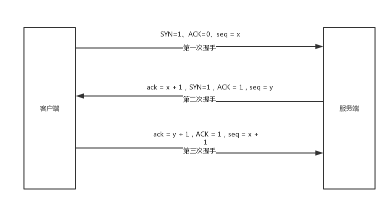
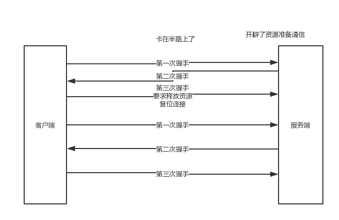
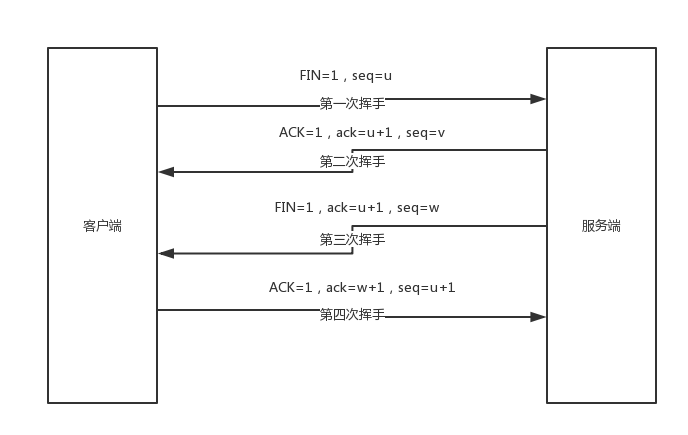

# 49、画一下TCP三次握手流程图？为啥是三次而不是二次或者四次呢？
1、面试题

 

TCP三次握手和四次握手的工作流程是什么（画一下流程图）？为什么不是五次握手或者两次握手？

 

2、面试官心里分析

 

这个问题相当经典，大家可别以为就是考察应届生的，实际上在普通社招java面试中，一些大公司，很喜欢考察这个问题，尤其是后面第二个追加问题，让你聊聊为啥必须是三次握手，而不是两次呢？

 

3、面试题剖析

 

（1）tcp三次握手过程

 

通过传输层的tcp协议建立网络连接的时候，其实走的是三次握手的过程

 

建立三次握手的时候，TCP报头用到了下面几个东西，ACK、SYN、FIN。

 

第一次握手，客户端发送连接请求报文，此时SYN=1、ACK=0，这就是说这是个连接请求，seq = x，接着客户端处于SYN_SENT状态，等待服务器响应。

 

第二次握手，服务端收到SYN=1的请求报文，需要返回一个确认报文，ack = x + 1，SYN=1，ACK = 1，seq = y，发送给客户端，自己处于SYN_RECV状态。

 

第三次握手，客户端收到了报文，将ack = y + 1，ACK = 1，seq = x + 1

 

其实三次握手说白了，就是来回来去三次请求，每次请求带上一堆TCP报文头，根据报文头是否正确，就是越好的协议来建立连接。简单说就是这样。

 

（2）为啥不是2次或者4次握手呢？

 

假设两次握手就ok了，要是客户端第一次握手过去，结果卡在某个地方了，没到服务端；完了客户端再次重试发送了第一次握手过去，服务端收到了，ok了，大家来回来去，三次握手建立了连接。

 

结果，尴尬的是，后来那个卡在哪儿的老的第一次握手发到了服务器，服务器直接就返回一个第二次握手，这个时候服务器开辟了资源准备客户端发送数据啥的，结果呢？客户端根本就不会理睬这个发回去的二次握手，因为之前都通信过了。

 

但是如果是三次握手，那个二次握手发回去，客户端发现根本不对，就会发送个复位的报文过去，让服务器撤销开辟的资源，别等着了。

 

因为3次握手就够了，不需要4次或者5次浪费资源了。

 

（3）tcp断开连接的4次挥手

 

第一次挥手，客户端发送报文，FIN=1，seq=u，此时进入FIN-WAIT-1状态

 

第二次挥手，服务端收到报文，这时候进入CLOSE_WATI状态，返回一个报文，ACK=1，ack=u+1，seq=v。客户端收到这个报文之后，直接进入FIN-WAIT-2状态，此时客户端到服务端的连接就释放了。

 

第三次挥手，服务端发送连接释放报文，FIN=1，ack=u+1，seq=w，服务端进入LAST-ACK状态

 

第四次挥手，客户端收到连接释放报文之后，发应答报文，ACK=1，ack=w+1，seq=u+1，进入TIME_WAIT状态，等待一会儿客户端进入CLOSED状态，服务端收到报文之后就进入CLOSED状态。

 
