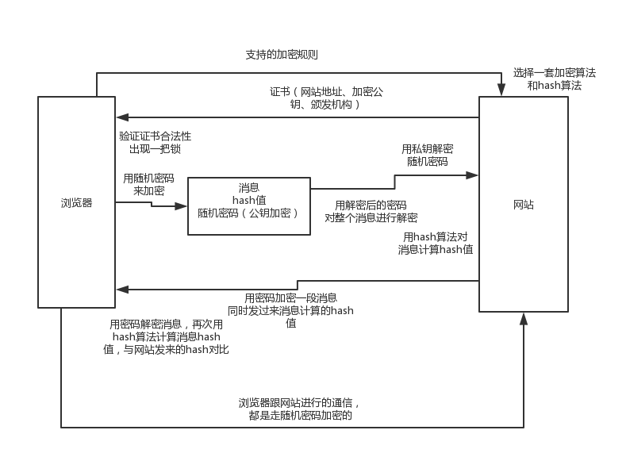

# 51、聊聊HTTPS的工作原理？为啥用HTTPS就可以加密通信？

## 1、面试题

 

http和https的区别是什么？https的原理是什么？

 

## 2、面试官心理分析

 

聊到http了，那肯定会聊聊https

 

## 3、面试题剖析

 

http协议都是明文的，是没有加密的，所以其实现在一般大部分应用都是用https协议的。之前是基于SSL协议对http进行加密，后来又升级到了TSL协议来加密，现在称之为SSL / TSL吧。

 

https的工作原理大概是这样的：

 

（1）浏览器把自己支持的加密规则发送给网站

 

（2）网站从这套加密规则里选出来一套加密算法和hash算法，然后把自己的身份信息用证书的方式发回给浏览器，证书里有网站地址、加密公钥、证书颁发机构

 

（3）浏览器验证证书的合法性，然后浏览器地址栏上会出现一把小锁；浏览器接着生成一串随机数密码，然后用证书里的公钥进行加密，这块走的非对称加密；用约定好的hash算法生成握手消息的hash值，然后用密码对消息进行加密，然后把所有东西都发给网站，这块走的是对称加密

 

（4）网站，从消息里面可以取出来公钥加密后的随机密码，用本地的私钥对消息解密取出来密码，然后用密码解密浏览器发来的握手消息，计算消息的hash值，并验证与浏览器发送过来的hash值是否一致，最后用密码加密一段握手消息，发给浏览器

 

（5）浏览器解密握手消息，然后计算消息的hash值，如果跟网站发来的hash一样，握手就结束，之后所有的数据都会由之前浏览器生成的随机密码，然后用对称加密来进行进行加密。

 

常用的非对车呢加密是RSA算法，对称加密是AES、RC4等，hash算法就是MD5

 

就好比，有个人说我加密的时候是用了一个公钥去加密，然后你解密的时候是用私钥去解密；我加密的时候用的算法，跟解密的时候用的算法，是一样的，对称加密

