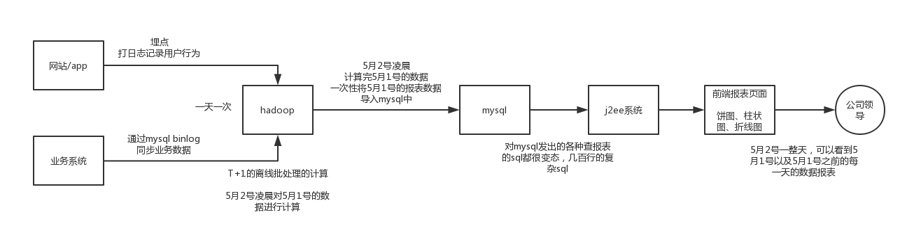

# 54、MySQL、MyISAM和InnoDB存储引擎的区别是啥？（下）

## 1、面试题

MySQL有哪些存储引擎啊（myisam和innodb）？都有什么区别？请详细说明一下。

 

## 2、面试官心里分析

这个其实说实话也是聊MySQL必备的问题，我已经在指导我们架构班的同学在外面跳槽了，根据大家的反馈来看，我觉得确实是，数据库这块还是经常问的，确实可以看到，20多k的职位的话，这块问的不会太深的，就是问问常规的一些问题。

 

## 3、面试题剖析

mysql支持的存储引擎有很多种，innodb、myisam、memory，很多，但是我就讲其中两种，因为其实现在，常用的就一种，innodb，myisam以前可能还有一些场景会用，现在用的已经非常少了

 

###（1）myisam

myisam，不支持事务，不支持外键约束，索引文件和数据文件分开，这样在内存里可以缓存更多的索引，对查询的性能会更好，适用于那种少量的插入，大量查询的场景。

 

比如说最经典的就是报表系统，比如大数据的报表系统，给大家画个图聊聊一半都是怎么玩儿的，常见的就是走hadoop生态来搞，hdfs来存储数据，然后基于hive来进行数仓建模，每次hive跑出来的数据都用sqoop从hive中导出到mysql中去。然后基于mysql的在线查询，就接上j2ee写个简单的web系统，每个报表开发一套代码，写sql查数据，组织数据，按照前端要求的格式返回数据，展现出来一个报表。

 

这种报表系统，是最适合mysql的myisam存储引擎的，不需要事务，就是一次性批量导入，接下来一天之内就是纯查询了。

这个是比较low的做法，说实在的，现在你要让我说myisam的场景其实不多了，在很多大数据场景里是不适用的，因为真正的大数据系统，很多时候hadoop跑出来的结果还是很大，一天就几千万结果数据，几十亿明细数据，那mysql是抗不住这么大量的数据的。所以现在大数据一般用kylin做离线数据的分析引擎，直接hive数据导入kylin里面去了，或者也可以走elasticsearch。

 

尝试过做过一个事情，用mysql分库分表来抗，抗不住了，单表一般建议是控制在几百万的数据量级，500w以内的数据量，多少表？多少库？多少台数据库服务器？sql多达几百行，各种子查询、join、函数、行转列、列传行，非常不适合用mysql -> 数据量很大 -> sql很复杂 -> 导致mysql数据库服务器cpu负载过高

 

比较高端一点了，我们会基于自己研发的可配置化BI系统 + kylin + elasticsearch，支持大规模数据的复杂报表的支持，做的非常好，效果远远超出基于mysql的那套方案

 

后来还有那种实时数据报表，就是storm或者是spark streaming，跑数据出来，来一条算一条，然后结果立马写入mysql中，这个的话，一般就保留当天数据，其实压力不会太大，但是问题在于说，可能写并发会超高，每秒并发轻易就可以几千甚至上万。所以大数据实时报表不会写mysql了，现在一般都是写es。

 

你可以按照我上面的这套说辞去说说，如果是java方向的同学，就说你们之前配合你们公司的数据团队开发过这种报表系统的j2ee部分，所以当时用myisam比较多，但是后来人家几乎都不用了，借此体现出你是有实际经验的，这回答的档次都不一样了。

 

###（2）innodb

说真的，现在一般用mysql都是innodb，我真很少用其他的存储引擎，而且国内用其他存储引擎的场景和公司也不多，所以用innodb就可以了，而且这个也是mysql 5.5之后的默认存储引擎。

 

主要特点就是支持事务，走聚簇索引，强制要求有主键，支持外键约束，高并发、大数据量、高可用等相关成熟的数据库架构，分库分表、读写分离、主备切换，全部都可以基于innodb存储引擎来玩儿，如果真聊到这儿，其实大家就可以带一带，说你们用innodb存储引擎怎么玩儿分库分表支撑大数据量、高并发的，怎么用读写分离支撑高可用和高并发读的，用上第1季的内容就可以了。

 

说实话，关于存储引擎，现在因为其实真的主要就是innodb，聊到这儿就可以了，反而被问到这问题，多拓展根据你的经验来回答
