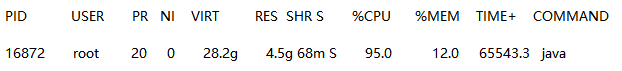

# 65、线上服务器CPU 100%了！该怎么排查、定位和解决？

## 1、面试题

线上服务器的cpu使用达到100%了，如何排查、定位和解决该问题？

 

## 2、面试官心里分析

说实话，这个问题是面试的时候，聊基础，最常问的一个问题，就是看看你有没有处理过高负载的线上问题场景。所以很多大公司考察你的基本功，肯定会问这个。其实这个你干过就是干过，掌握就是掌握，只要干过，所有人都是一样的步骤，没区别。

 

## 3、面试题剖析

其实核心思路，就是找到这台服务器上，是哪个进程的哪个线程的哪段代码，导致cpu 100了，主要就是考察你是否熟练运用一些线上的命令。

 

这里我可以给大家说一个我们线上的经验，就是之前有一个bug，是一个很年轻的同学写的，就是我们当时是定了异常日志是写到es里去的

 

```text
public void log(String message) {
    try {
    
    // 往es去写
    } catch(Exception e) {
        log(message);
    }
}
```

 

线上事故，es集群出了点问题，没法写，最后出现线上几十台机器，全部因为这一行代码，全体cpu 100%，卡死了

 

###（1）定位耗费cpu的进程

 

top -c，就可以显示进程列表，然后输入P，按照cpu使用率排序，你会看到类似下面的东西

|  PID   | USER  |PR  | NI   | VIRT  | RES  |SHR  | S   | %CPU  |%MEM  | TIME+  | COMMAND       |
|  ----  | ----  |----| ---- | ----  | ---- |---- | ----| ----  |----  | ----   | ----          |
| 43987  | root  |20  | 0    | 28.2g | 4.5g |68m  | S   | 99.0  |24.0  |44333.4 | java -Xms。。。|


 

大概类似上面这样，能看到哪个进程，CPU负载最高，还有启动这个进程的命令，比如一般就是java啥啥的。

 

###（2）定位耗费cpu的线程

 

top -Hp 43987，就是输入那个进程id就好了，然后输入P，按照cpu使用率排序，你会看到类似下面的东西




大概类似上面那样，你就可以看到这个进程里的哪个线程耗费cpu最高

 

###（3）定位哪段代码导致的cpu过高

 

printf “%x\n” 16872，把线程pid转换成16进制，比如41e8

 

jstack 43987 | grep ‘0x41e8’ -C5 --color

 

这个就是用jstack打印进程的堆栈信息，而且通过grep那个线程的16进制的pid，找到那个线程相关的东西，这个时候就可以在打印出的代码里，看到是哪个类的哪个方法导致的这个cpu 100%的问题
