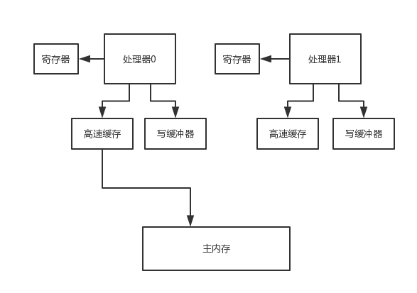
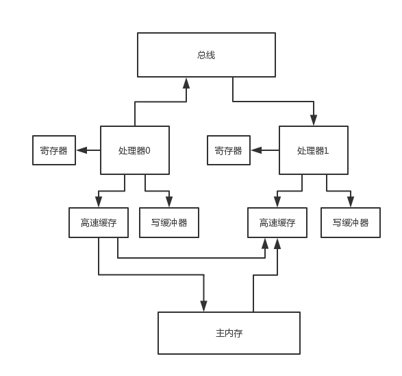

# 71、可见性涉及的底层硬件概念：寄存器、高速缓存、写缓冲器（上）

从硬件的级别来考虑一下可见性的问题

 

每个处理器都有自己的寄存器（register），所以多个处理器各自运行一个线程的时候，可能导致某个变量给放到寄存器里去，接着就会导致各个线程没法看到其他处理器寄存器里的变量的值修改了

 

可见性的第一个问题，首先，就有可能在寄存器的级别，导致变量副本的更新，无法让其他处理器看到

 

然后一个处理器运行的线程对变量的写操作都是针对写缓冲来的（store buffer）并不是直接更新主内存，所以很可能导致一个线程更新了变量，但是仅仅是在写缓冲区里罢了，没有更新到主内存里去

 

这个时候，其他处理器的线程是没法读到他的写缓冲区的变量值的，所以此时就是会有可见性的问题，这是第二个可见性发生的场景

 

然后即使这个时候一个处理器的线程更新了写缓冲区之后，将更新同步到了自己的高速缓存里（cache，或者是主内存），然后还把这个更新通知给了其他的处理器，但是其他处理器可能就是把这个更新放到无效队列里去，没有更新他的高速缓存

 

此时其他处理器的线程从高速缓存里读数据的时候，读到的还是过时的旧值

 

可见性发生的问题

 

如果要实现可见性的话，其中一个方法就是通过MESI协议，这个MESI协议实际上有很多种不同的时间，因为他不过就是一个协议罢了，具体的实现机制要靠具体底层的系统如何实现

 

根据具体底层硬件的不同，MESI协议的实现是有区别的

 

比如说MESI协议有一种实现，就是一个处理器将另外一个处理器的高速缓存中的更新后的数据拿到自己的高速缓存中来更新一下，这样大家的缓存不就实现同步了，然后各个处理器的线程看到的数据就一样了

 

为了实现MESI协议，有两个配套的专业机制要给大家说一下：flush处理器缓存、refresh处理器缓存。

 

flush处理器缓存，他的意思就是把自己更新的值刷新到高速缓存里去（或者是主内存），因为必须要刷到高速缓存（或者是主内存）里，才有可能在后续通过一些特殊的机制让其他的处理器从自己的高速缓存（或者是主内存）里读取到更新的值

 

除了flush以外，他还会发送一个消息到总线（bus），通知其他处理器，某个变量的值被他给修改了

 

refresh处理器缓存，他的意思就是说，处理器中的线程在读取一个变量的值的时候，如果发现其他处理器的线程更新了变量的值，必须从其他处理器的高速缓存（或者是主内存）里，读取这个最新的值，更新到自己的高速缓存中

 

所以说，为了保证可见性，在底层是通过MESI协议、flush处理器缓存和refresh处理器缓存，这一整套机制来保障的

 

要记住，flush和refresh，这两个操作，flush是强制刷新数据到高速缓存（主内存），不要仅仅停留在写缓冲器里面；refresh，是从总线嗅探发现某个变量被修改，必须强制从其他处理器的高速缓存（或者主内存）加载变量的最新值到自己的高速缓存里去

 

内存屏障的使用，在底层硬件级别的原理，其实就是在执行flush和refresh，MESI协议是如何与内存屏障搭配使用的（flush、refresh）

 

volatile boolean isRunning = true;

 

isRunning = false; => 写volatile变量，就会通过执行一个内存屏障，在底层会触发flush处理器缓存的操作；while(isRunning) {}，读volatile变量，也会通过执行一个内存屏障，在底层触发refresh操作

 

之前给大家讲过那个volatile关键字的作用，对一个变量加了volatile修饰之后，对这个变量的写操作，会执行flush处理器缓存，把数据刷到高速缓存（或者是主内存）中，然后对这个变量的读操作，会执行refresh处理器缓存，从其他处理器的高速缓存（或者是主内存）中，读取最新的值

 

当然跟我们之前说的有一点点不一样，因为之前说的是写volatile变量的时候，一个是强制刷主内存，一个是过期掉其他处理器的高速缓存中的数据；读volatile变量的时候，会发现高速缓存中的值过期，然后强制从主内存加载最新值

 

其实这个东西吧，你没发现么，效果是一样的，他其实本质都是让一个线程写了volatie变量之后，另外一个变量立马可以读到volatile变量的值，只不过MESI协议的底层具体实现，根据cpu等硬件的不同，有多种不同的实现方式罢了
