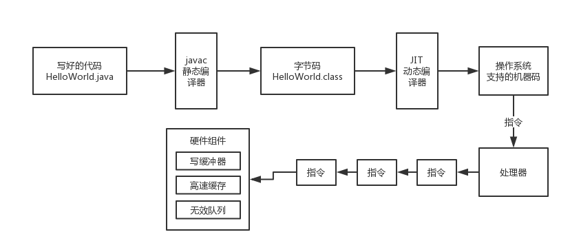

# 73、深入探秘有序性：Java程序运行过程中发生指令重排的几个地方

我们写好的代码在实际执行的时候那个顺序可能在很多环节都会被人给重排序，一旦重排序之后，在多线程并发的场景下，就有可能会出现一些问题

 

（1）自己写的源代码中的执行顺序：这个是我们自己写的代码，一般来说就是按照我们自己脑子里想的样子来写

 

（2）编译后的代码的执行顺序：java里有两种编译器，一个是静态编译器（javac），一个是动态编译器（JIT）。javac负责把.java文件中的源代码编译为.class文件中的字节码，这个一般是程序写好之后进行编译的。JIT负责把.class文件中的字节码编译为JVM所在操作系统支持的机器码，一般在程序运行过程中进行编译。

 

在这个编译的过程中，编译器是很有可能调整代码的执行顺序的，为了提高代码的执行效率，很可能会调整代码的执行顺序，JIT编译器对指令重排的还是挺多的

 

（3）处理器的执行顺序：哪怕你给处理器一个代码的执行顺序，但是处理器还是可能会重排代码，更换一种执行顺序，JIT编译好的指令的时候，还是可能会调整顺序

 

（4）内存重排序：有可能你这个处理器在实际执行指令的过程中，在高速缓存和写缓冲器、无效队列等等，硬件层面的组件，也可能会导致你的指令的执行看起来的顺序跟想象的不太一样

 

上述就是在我们写好java代码之后，从编译到执行的过程中，可能代码的执行顺序可能会有指令重排的地方，只要有指令重排就有一定可能造成程序执行异常

 

但是编译器和处理器不是胡乱的重排序的，他们会遵循一个关键的规则，就是数据依赖规则，如果说一个变量的结果依赖于之前的代码执行结果，那么就不能随意进行重排序，要遵循数据的依赖

 

比如说：

 

int a = 3;

int b = 5;

int c = a * b;

 

那第三行代码依赖于上面两行代码，第一行和第二行代码可以重排序，但是第三行代码必须放在最下面

 

此外，之前给大家介绍过happens-before原则，就是有一些基本的规则是要遵守的，不会让你胡乱的重排序

 

在遵守一定的规则的前提下，有好几个层面的代码和指令都可能出现重排序
