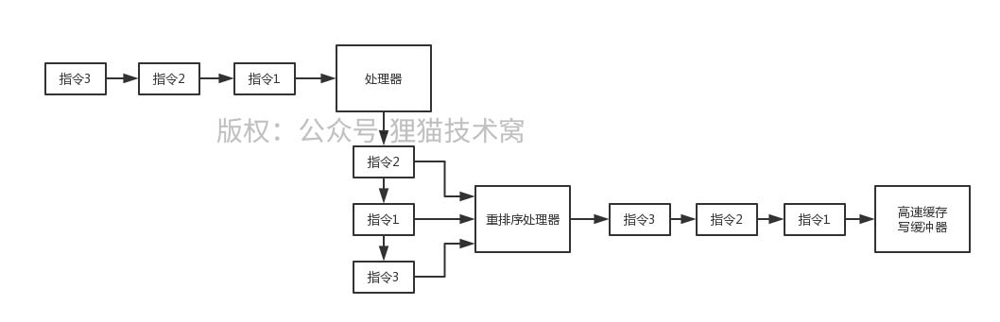

# 75、现代处理器为了提升性能的指令乱序和猜测执行的机制！



指令乱序机制

 

指令不一定说是拿到了一个指令立马可以执行的，比如有的指令是要进行网络通信、磁盘读写，获取锁，很多种，有的指令不是立马就绪可以执行的，为了提升效率，在现代处理器里面都是走的指令的乱序执行机制

 

把编译好的指令一条一条读取到处理器里，但是哪个指令先就绪可以执行，就先执行，不是按照代码顺序来的。每个指令的结果放到一个重排序处理器中，重排序处理器把各个指令的结果按照代码顺序应用到主内存或者写缓冲器里

 

这就导致处理器可能压根儿就是乱序在执行我们代码编译后的指令

 

另外还有一个猜测执行，比如说if判断中有一坨代码，很可能先去执行if里的代码算出来结果，然后最后再来判断if是否成立

```text
int sum = 0
if(flag) {
    for(int i = 0; i < 10; i++) {
    
    }
}
```
