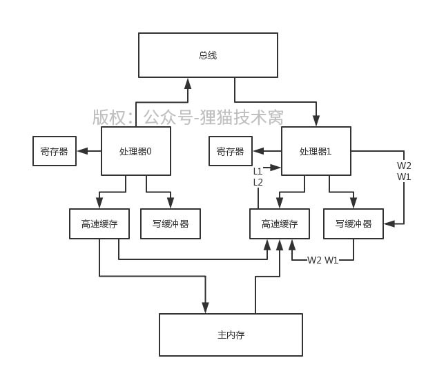

# 76、高速缓存和写缓冲器的内存重排序造成的视觉假象

处理器会将数据写入写缓冲器，这个过程是store；从高速缓存里读数据，这个过程是load。写缓冲器和高速缓存执行load和store的过程，都是按照处理器指示的顺序来的，处理器的重排处理器也是按照程序顺序来load和store的

 

但是有个问题，就是在其他的处理器看到的一个视觉假象而言，有可能会出现看到的load和store是重排序的，也就是内存重排序

 

处理器的乱序执行和推测执行，都是指令重排序，这次说的是内存重排序，因为都是发生在内存层面的写缓冲器和高速缓存中的

 

这个内存重排序，有4种可能性：

 

（1）LoadLoad重排序：一个处理器先执行一个L1读操作，再执行一个L2读操作；但是另外一个处理器看到的是先L2再L1

 

（2）StoreStore重排序：一个处理器先执行一个W1写操作，再执行一个W2写操作；但是另外一个处理器看到的是先W2再W1

 

（3）LoadStore重排序：一个处理器先执行一个L1读操作，再执行一个W2写操作；但是另外一个处理器看到的是先W2再L1

 

（3）StoreLoad重排序：一个处理器先执行一个W1写操作，再执行一个L2读操作；但是另外一个处理器看到的是先L2再W1

 

给大家举个例子，比如说写缓冲器为了提升性能，有可能先后到来W1和W2操作了之后，他先执行了W2操作，再执行了W1操作。那这个时候其他处理器看到的可不就是先W2再W1了，这就是StoreStore重排序

 

共享变量：

Resource resource = null;

Boolean resourceLoaded = false;

处理器0：

resource = loadResoureFromDisk();

resourceLoaded = true;

处理器1：

while(!resourceLoaded) {

try {

Thread.sleep(1000);

} catch(Exception) {

}

}

resource.execute();

类似上面的代码，很可能处理器0先写了resource，再写了resourceLoaded。结果呢，写缓冲器进行了内存重排序，先落地了resourceLoaded = true了，此时resource还是null。此时处理器1就会看到resourceLoaded = true，就会对resource对象执行execute()方法，此时就会有空指针异常的问题

 

反正类似的情况，高速缓存和写缓冲器都可以自己对Load和Store操作的结果落地到内存进行各种不同的重排序，进而造成上述4种内存重排序问题的发生
