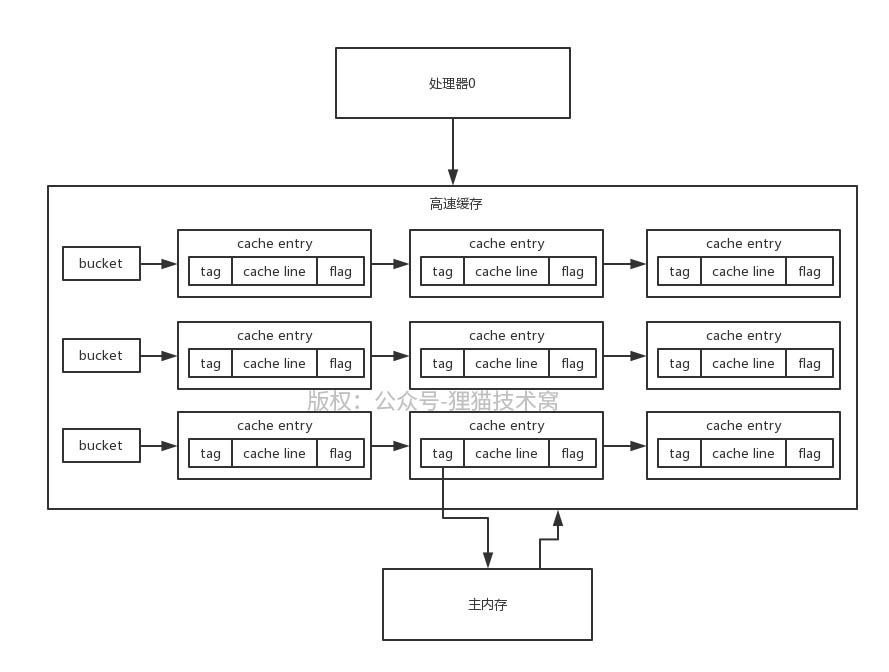

# 81、高速缓存的数据结构：拉链散列表、缓存条目以及地址解码（上）

如果这周的课不讲，只是靠着之前的课，volatile和synchronized的原理，也能说，但是说的比较浅层一些，主要是从基础的层面来聊一下他的原理，底层的细节肯定是不行的，但是这周的课讲完了

 

volatile和synchronized

 

原子性、可见性和有序性三个方面分别来聊，这两个关键字对那几个“性”的保障是通过什么来实现的。聊到他们会加哪些内存屏障，怎么加，这些内存屏障的效果，结合底层硬件层面的一个初步的原理，来给面试官聊一下。

 

还是有一些遗憾的，内存屏障在硬件层面的实现的原理，到底是怎么回事，能不能再细一点，再深入一些，让大家在面试的时候聊到volatile和synchronized，直接震慑式的回答。硬件层面的一些原理

 

MESI协议在硬件层面的实现机制，光靠初步的MESI协议是无法保证可见性和有序性的

 

内存屏障在硬件层面的细致的原理，到底是如何控制那些硬件的交互和行为，最终实现可见性和有序性的保障的

 

volatile和synchronized，底层，彻底通透

 

synchronized的一些JVM对锁的优化，讲解一下；CAS底层其实也是要靠这套硬件级别的原理来给说清楚，compareAndSwap操作到底是如何在底层实现原子性的，这个东西我之前也没讲

 

ThreadLocal，源码基本；ReentrantLock，读写锁，源码级别

 

处理器高速缓存的底层数据结构实际是一个拉链散列表的结构，就是有很多个bucket，每个bucket挂了很多的cache entry，每个cache entry由三个部分组成：tag、cache line和flag，其中的cache line就是缓存的数据

 

tag指向了这个缓存数据在主内存中的数据的地址，flag标识了缓存行的状态，另外要注意的一点是，cache line中可以包含多个变量的值

 

处理器会操作一些变量，怎么在高速缓存里定位到这个变量呢？

 

那么处理器在读写高速缓存的时候，实际上会根据变量名执行一个内存地址解码的操作，解析出来3个东西，index、tag和offset。index用于定位到拉链散列表中的某个bucket，tag是用于定位cache entry，offset是用于定位一个变量在cache line中的位置

 

如果说可以成功定位到一个高速缓存中的数据，而且flag还标志着有效，则缓存命中；否则不满足上述条件，就是缓存未命中。如果是读数据未命中的话，会从主内存重新加载数据到高速缓存中，现在处理器一般都有三级高速缓存，L1、L2、L3，越靠前面的缓存读写速度越快
