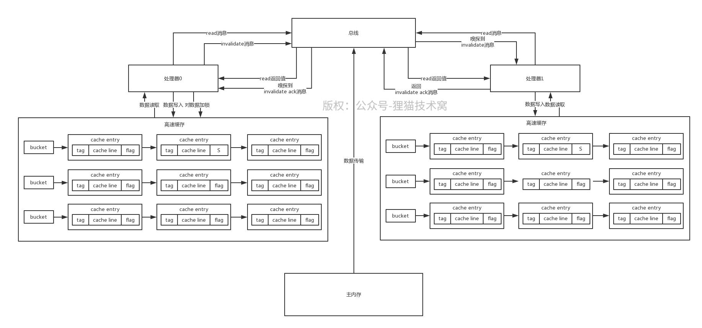

# 84、结合硬件级别的缓存数据结构深入分析缓存一致性协议（下）
因为有高速缓存的存在，所以就导致各个处理器可能对一个变量会在自己的高速缓存里有自己的副本，这样一个处理器修改了变量值，别的处理器是看不到的，所以就是为了这个问题引入了缓存一致性协议（MESI协议）

 

MESI协议规定：对一个共享变量的读操作可以是多个处理器并发执行的，但是如果是对一个共享变量的写操作，只有一个处理器可以执行，其实也会通过排他锁的机制保证就一个处理器能写

 

之前说过那个cache entry的flag代表了缓存数据的状态，MESI协议中划分为：

 

（1）invalid：无效的，标记为I，这个意思就是当前cache entry无效，里面的数据不能使用

 

（2）shared：共享的，标记为S，这个意思是当前cache entry有效，而且里面的数据在各个处理器中都有各自的副本，但是这些副本的值跟主内存的值是一样的，各个处理器就是并发的在读而已

 

（3）exclusive：独占的，标记为E，这个意思就是当前处理器对这个数据独占了，只有他可以有这个副本，其他的处理器都不能包含这个副本

 

（4）modified：修改过的，标记为M，只能有一个处理器对共享数据更新，所以只有更新数据的处理器的cache entry，才是exclusive状态，表明当前线程更新了这个数据，这个副本的数据跟主内存是不一样的

 

MESI协议规定了一组消息，就说各个处理器在操作内存数据的时候，都会往总线发送消息，而且各个处理器还会不停的从总线嗅探最新的消息，通过这个总线的消息传递来保证各个处理器的协作

 

下面来详细的图解MESI协议的工作原理，处理器0读取某个变量的数据时，首先会根据index、tag和offset从高速缓存的拉链散列表读取数据，如果发现状态为I，也就是无效的，此时就会发送read消息到总线

 

接着主内存会返回对应的数据给处理器0，处理器0就会把数据放到高速缓存里，同时cache entry的flag状态是S

 

在处理器0对一个数据进行更新的时候，如果数据状态是S，则此时就需要发送一个invalidate消息到总线，尝试让其他的处理器的高速缓存的cache entry全部变为I，以获得数据的独占锁。

 

其他的处理器1会从总线嗅探到invalidate消息，此时就会把自己的cache entry设置为I，也就是过期掉自己本地的缓存，然后就是返回invalidate ack消息到总线，传递回处理器0，处理器0必须收到所有处理器返回的ack消息

 

接着处理器0就会将cache entry先设置为E，独占这条数据，在独占期间，别的处理器就不能修改数据了，因为别的处理器此时发出invalidate消息，这个处理器0是不会返回invalidate ack消息的，除非他先修改完再说

 

接着处理器0就是修改这条数据，接着将数据设置为M，也有可能是把数据此时强制写回到主内存中，具体看底层硬件实现

 

然后其他处理器此时这条数据的状态都是I了，那如果要读的话，全部都需要重新发送read消息，从主内存（或者是其他处理器）来加载，这个具体怎么实现要看底层的硬件了，都有可能的

 

这套机制其实就是缓存一致性在硬件缓存模型下的完整的执行原理

