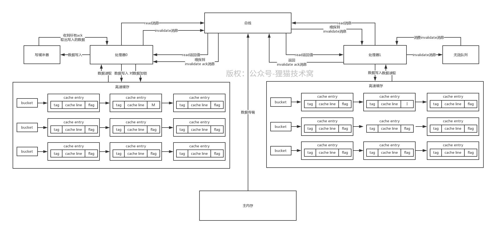

# 85、采用写缓冲器和无效队列优化MESI协议的实现性能

MESI协议如果每次写数据的时候都要发送invalidate消息等待所有处理器返回ack，然后获取独占锁后才能写数据，那可能就会导致性能很差了，因为这个对共享变量的写操作，实际上在硬件级别变成串行的了

 

所以为了解决这个问题，硬件层面引入了写缓冲器和无效队列

 

写缓冲器的作用是，一个处理器写数据的时候，直接把数据写入缓冲器，同时发送invalidate消息，然后就认为写操作完成了，接着就干别的事儿了，不会阻塞在这里。接着这个处理器如果之后收到其他处理器的ack消息之后

 

才会把写缓冲器中的写结果拿出来，通过对cache entry设置为E加独占锁，同时修改数据，然后设置为M

其实写缓冲器的作用，就是处理器写数据的时候直接写入缓冲器，不需要同步阻塞等待其他处理器的invalidate ack返回，这就大大提升了硬件层面的执行效率了

 

包括查询数据的时候，会先从写缓冲器里查，因为有可能刚修改的值在这里，然后才会从高速缓存里查，这个就是存储转发

 

引入无效队列，就是说其他处理器在接收到了invalidate消息之后，不需要立马过期本地缓存，直接把消息放入无效队列，就返回ack给那个写处理器了，这就进一步加速了性能，然后之后从无效队列里取出来消息，过期本地缓存即可

 

通过引入写缓冲器和无效队列，一个处理器要写数据的话，这个性能其实很高的，他直接写数据到写缓冲器，发送一个validate消息出去，就立马返回，执行别的操作了；其他处理器收到invalidate消息之后直接放入无效队列，立马就返回invalidate ack
