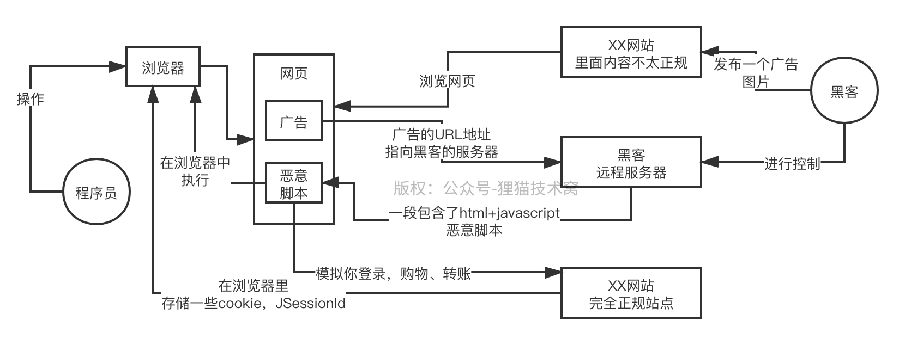
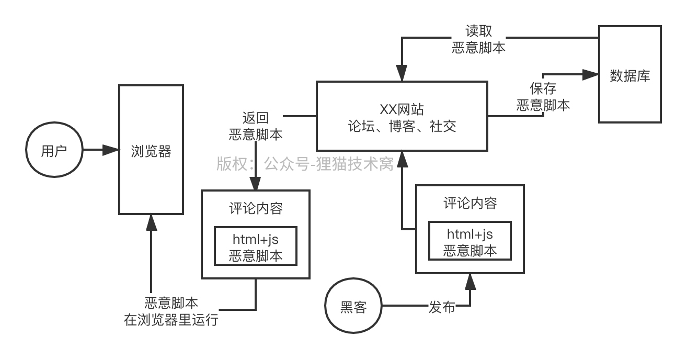

# 94、能不能说说一般黑客常用的XSS网络攻击的原理是什么？

XSS攻击和SQL注入就是大部分的黑客进行网络攻击的手段，此外还有很多别的攻击方式，比如说CSRF、Session劫持之类的，今天先说说XSS网络攻击的原理

 

XSS的全称是Cross Site Script，就是跨站点脚本攻击，意思就是说，黑客恶意篡改你的网页的前端代码，在里面注入一些他自己的html+javascript的脚本和代码，然后你比如在访问那个网站的网页的时候，他注入的那些恶意脚本就会运行了

 

恶意脚本运行的时候就会控制你的浏览器，这个时候他的脚本就可以做很多很多的事情了

 

第一种XSS攻击是反射型攻击，他主要是想办法让你点击一个URL链接，在这个URL链接里就嵌入他自己的恶意脚本，你点击那个URL链接之后，那个URL指向的是黑客自己的服务器上的一段恶意脚本

 

他可能给你展示的是一个什么什么图片，或者是一个flash的动图，或者是一个小视频的东西，诱惑性，引诱你去点击

 

然后恶意脚本被返回到你的浏览器里就会运行，然后就可以控制你的浏览器里的行为了，这个控制行为就很恐怖了，他可以干很多的事儿，比如说脚本可以自动让你关注某个用户ID，然后控制你自动发布一个带有病毒的微博，这是比较简单的

 

实际上来说，一段恶意的js脚本，几乎可以说是无恶不作的，因为他一旦控制了你的浏览器就可以得到大量的东西，大家都知道浏览器里包含了你的一些cookie，有的浏览器可能还存储了你的密码，通过知道你的cookie，就可以利用cookie伪造你的用户登录的session状态，去以你这个用户的名义干一些事儿

 

另外一种XSS攻击是叫做持久型攻击，这个意思就是说，举个例子，比如是个什么论坛、或者社交网站之类的系统，不是你可以发布一些帖子啊，或者是评论啥的内容么，此时黑客就可以在里面写一段恶意脚本

 

然后把恶意脚本混杂在评论内容里提交到你的网站的数据库里去

 

然后后面比如其他用户在社交网站里浏览到了你的这个评论，评论内容会被返回到浏览器里去，此时评论内容是包含恶意js脚本的，马上恶意脚本运行，又可以干坏事儿了，干的坏事儿就跟之前是一样的

 

如果要防止XSS攻击，一般来说手段有如下两种：

 

包含恶意URL链接的图片、视频、动图、flash动画，平时自己注意一下，少点，尽量使用正规的网站

 

消毒机制，这就是说，如果黑客在一些评论之类的内容里混入恶意脚本，那么你的代码里必须对内容进行消毒，就是进行一些转义，比如说把>转义为&gt之类的，这样就可以把恶意脚本里的html标签、js代码之类的东西，都给转义掉，让这些恶意脚本失效

 

<html> -> &lthtml&gt，这种东西在浏览器里是不会运行的

 

<html></html>

 

这样的话，转义以后的脚本被其他用户看到的时候也不会在浏览器里运行了

 

HttpOnly方式，这个意思是说如果你在浏览器里存放cookie的时候，可以设置一个HttpOnly属性，比如说存放用户加密认证信息的cookie，这样的话，在浏览器里运行的js脚本是被禁止访问这些HttpOnly cookie的，他就无法窃取你在浏览器里存储的cookie了
