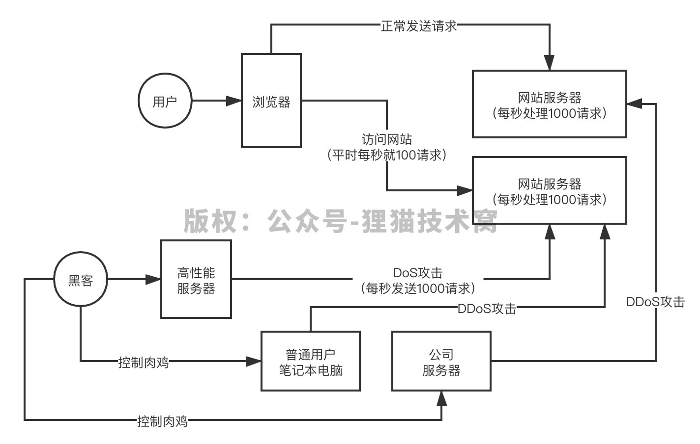

# 98、让所有工程师闻声色变的DDoS攻击到底是什么东西？

DDoS，distributed denial of service，分布式拒绝服务攻击，最可怕的黑客攻击，可以把你的网站、APP、系统给搞瘫痪了

 

DoS攻击，就是说黑客知道你的服务器地址了，然后你的系统假设每秒就抗下1000请求，黑客就以每秒1000请求访问你，你的服务器线程资源全部打满，正常用户根本无法发送请求，你的网站就宕机了

甚至他以每秒1万请求攻击你的服务器呢，那就的系统机器就挂了

 

DoS攻击是一对一的，就是黑客搞一台高性能服务器，拼命发送请求给你的一台服务器，但是如果你的服务器配置超高，每秒抗1万请求，结果黑客的机器每秒才5000请求，那么就没用了

 

DDoS的意思就是黑客控制大量的机器，比如普通人的电脑，或者是一些公司的服务器，被他的一些木马植入给控制了，就是所谓的“肉鸡”，然后黑客下达指令，让所有肉鸡一起发送请求给攻击目标，直接搞瘫你的服务器

 

如何防御DDoS攻击？自己其实挺难的，这其实是非常专业的一种攻击手段，通常我们可以采购云厂商的安全服务，比如DDoS高防IP，可以把攻击流量都导入到云厂商的高防IP的服务器上去，他们有专业的技术方案和算法来防御

 

明天继续讲，DDos的几种攻击方式，利用TCP三次握手的SYN Flood攻击，利用DNS查询的DNS Query Flood攻击，利用HTTP发起的CC攻击
