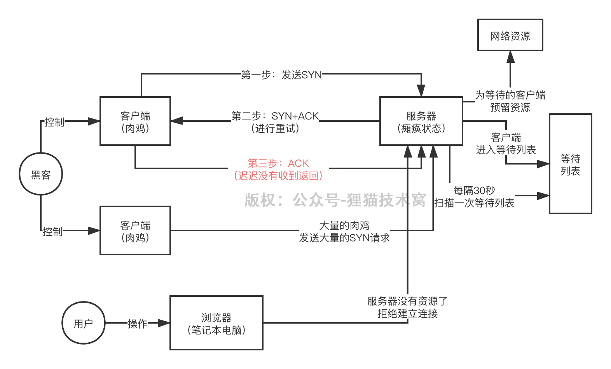

# 99、基于SYN Flood模式的DDoS攻击，背后的原理是什么呢？

TCP三次握手 

1、客户端发送一个SYN请求，指明客户端的端口号以及TCP连接的初始序列号

2、的服务器收到SYN后，返回一个SYN+ACK，表示请求被接收，TCP序列号加1

3、客户端收到服务器的SYN+ACK后，返回一个ACK给服务器，TCP序列号加1，连接建立完毕，接着可以通信了

 

如果服务器没有收到第三步的ACK，会重试返回SYN+ACK给客户端，同时处于SYN_RECV状态，把客户端放入等待列表。重试会3~5次，每隔30重试一次，遍历等待列表，再次重试发送SYN+ACK

 

只要返回SYN+ACK给客户端，就会为客户端预留一部分资源，重试期间都保留，等待跟客户端建立连接；所以如果说太多的客户端来建立连接，资源耗尽，那么就无法建立新的TCP连接了

 

所以黑客就会伪造大量的不同ip地址去发送SYN请求给一台服务器建立TCP连接，每次都是卡在服务器返回SYN+ACK，但是黑客是不会最终返回ACK的，所以导致服务器可能为了黑客建立了大量的半连接放在等待列表里，占用了大量的资源，还得不停的去重试

 

一旦服务器的资源耗尽，那么正常的请求过来，是无非建立TCP连接的

 

要知道，HTTP底层就是基于TCP实现的，一旦你无法建立TCP连接，那么这台服务器也自然接受不了任何HTTP请求
