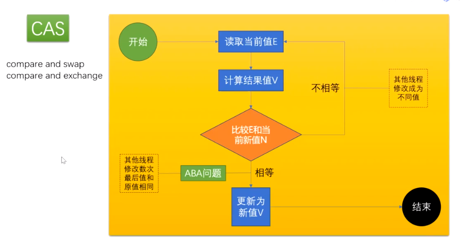

# Java多线程高并发

## 面试题
1. 描述`synchrnoized`和`reentrantlock`的底层实现及重入的底层原理-百度、阿里

2. 请描述锁的四种状态和升级过程-百度、阿里

3. CAS的ABA问题如何解决 -百度

4. 请谈一下AQS,为什么AQS的底层是CAS+volatile-百度

5. `volcatitle`的可见性和禁止指令重排序是如何实现的-美团

6. CAS是什么 -美团

7. 请描述一下对象的创建过程 -美团、顺丰

8. 对象在内存中的内存布局-美团、顺丰

9. DCL单例为什么要加`volcatile` -美团

10. 解释一下锁的四种状态 -顺丰

11. Object o=new Object()在内存中占了多少字节? -顺丰

12. 请描述你对as-if-serial和happens-before语义的理解 -京东

13. 你了解`ThreadLocal`吗?你知道`ThreadLocal`中如何解决内存泄露问题吗? -京东、阿里

14. 请描述一下锁的分类以及JDK中的应用-阿里

## 1-volatile关键字的字节码原语

### CAS



AtomicBoolean、AtomicInteger、AtomicLong等原子类使用CAS机制,Compare And Swap(比较和交换)

CAS机制当中使用了3个基本操作数：内存地址V，旧的预期值A，要修改的新值B

```java
// CAS在java中的应用,AtomicInteger#decrementAndGet#getAndAddInt#compareAndSwapInt
public final int getAndAddInt(Object var1, long var2, int var4) {
    int var5;
    do {
        var5 = this.getIntVolatile(var1, var2);
    } while(!this.compareAndSwapInt(var1, var2, var5, var5 + var4));

    return var5;
}
```

### ABA
ABA: 你女朋友和你分手,然后又和你复合,中间不知道经历了什么过程

1、ABA问题

CAS实现的过程是先取出内存中某时刻的数据,在下一时刻比较并替换,那么在这个时间差会导致数据的变化,此时就会导致出现"ABA"问题.

2、什么是”ABA”问题？

比如说一个线程one从内存位置V中取出A,这时候另一个线程two也从内存中取出A,并且two进行了一些操作变成了B,然后two又将V位置的数据变成A,这时候线程one进行CAS操作发现内存中仍然是A,然后one操作成功.

尽管线程one的CAS操作成功,但是不代表这个过程就是没有问题的.

3、解决

加版本号

boolean标识,true代表改过

## 2-synchronized与volatile的硬件级实现

## 3-无锁、偏向锁、轻量级锁、重量级锁升级过程

## 4-内存屏障的基本概念

## 5-使用线程池的好与不好

## 6-为什么阿里开发手册建议自定义线程池

## 7-自定义线程池的最佳实践

##

##

##

##

## ref

视频教程: https://www.bilibili.com/video/BV1xK4y1C7aT
