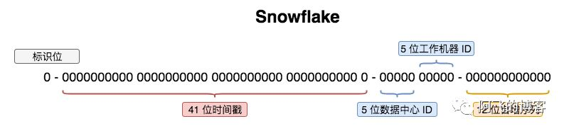
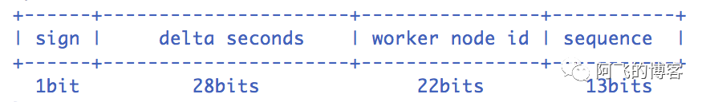
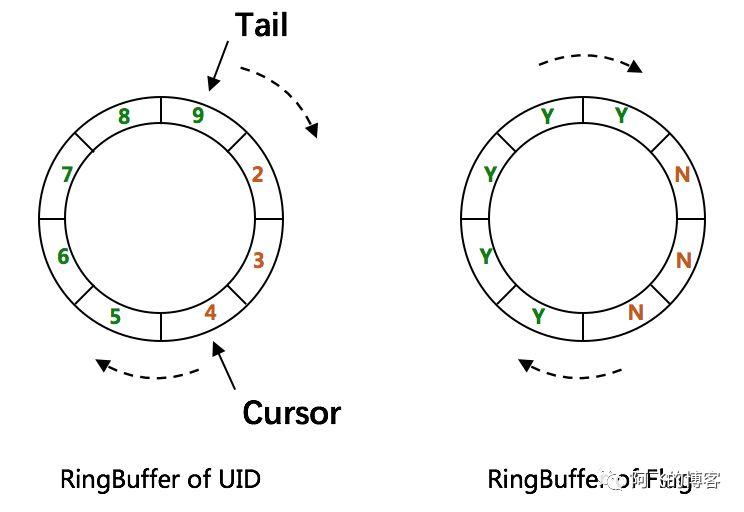

# 百度开源的分布式 ID 服务是如何解决时钟回拨问题的？

[uid-generator github](https://github.com/baidu/uid-generator)

`UidGenerator`是百度开源的Java语言实现，基于Snowflake算法的唯一ID生成器。而且，它非常适合虚拟环境，比如：Docker。

另外，它通过消费未来时间克服了雪花算法的并发限制。UidGenerator提前生成ID并缓存在RingBuffer中。压测结果显示，单个实例的QPS能超过6000,000。依赖环境：

* JDK8+
* MySQL（用于分配WorkerId）

## snowflake
由下图可知，雪花算法的几个核心组成部分：

1. 1位sign标识位
2. 41位时间戳
3. 10位workId(数据中心+工作机器,可以其他组成方式)
4. 12位自增序列



但是百度对这些组成部分稍微调整了一下:



由上图可知，UidGenerator的时间部分只有28位，这就意味着UidGenerator默认只能承受8.5年（2^28-1/86400/365）

当然，根据你业务的需求，UidGenerator可以适当调整delta seconds、worker node id和sequence占用位数。

接下来分析百度UidGenerator的实现。需要说明的是UidGenerator有两种方式提供：和DefaultUidGenerator和CachedUidGenerator。我们先分析比较容易理解的DefaultUidGenerator。

## DefaultUidGenerator
* delta seconds
这个值是指当前时间与epoch时间的时间差，且单位为秒。

epoch时间就是指集成UidGenerator生成分布式ID服务第一次上线的时间，可配置，也**一定**要根据你的上线时间进行配置，因为默认的epoch时间可是2016-09-20，不配置的话，会浪费好几年的可用时间。

* worker id
接下来说一下UidGenerator是如何给worker id赋值的，搭建UidGenerator的话，需要创建一个表：

```sql
DROP TABLE IF EXISTS WORKER_NODE;
CREATE TABLE WORKER_NODE(
  ID BIGINT NOT NULL AUTO_INCREMENT PRIMARY KEY ,
  HOST_NAME VARCHAR(64) NOT NULL COMMENT 'host name',
  PORT VARCHAR(64) NOT NULL COMMENT 'port',
  TYPE INT NOT NULL COMMENT 'node type: ACTUAL or CONTAINER',
  LAUNCH_DATE DATE NOT NULL COMMENT 'launch date',
  MODIFIED DATETIME NOT NULL COMMENT 'modified time',
  CREATED DATETIME NOT NULL COMMENT 'created time'
)
COMMENT='DB WorkerID Assigner for UID Generator',ENGINE = INNODB;
```

UidGenerator会在集成用它生成分布式ID的实例启动的时候，往这个表中插入一行数据，得到的id值就是准备赋给workerId的值。

由于workerId默认22位，那么，集成UidGenerator生成分布式ID的所有实例重启次数是不允许超过4194303次（即2^22-1），否则会抛出异常。

这段逻辑的核心代码来自DisposableWorkerIdAssigner.java中，当然，你也可以实现WorkerIdAssigner.java接口，自定义生成workerId。

* sequence

核心代码如下,几个实现的关键点:

1. synchronized保证线程安全;

2. 如果时间有任何的回拨,那么直接抛出异常;

3. 如果当前时间和上一次是同一秒时间,那么sequence自增。如果同一秒内自增值超过2^13-1,那么就会自旋等待下一秒（getNextSecond）;

4. 如果是新的一秒,那么sequence重新从0开始;

```java
protected synchronized long nextId() {
    long currentSecond = getCurrentSecond();
    if (currentSecond < lastSecond) {
        long refusedSeconds = lastSecond - currentSecond;
        throw new UidGenerateException("Clock moved backwards. Refusing for %d seconds", refusedSeconds);
    }
    if (currentSecond == lastSecond) {
        sequence = (sequence + 1) & bitsAllocator.getMaxSequence();
        if (sequence == 0) {
            currentSecond = getNextSecond(lastSecond);
        }
    } else {
        sequence = 0L;
    }
    lastSecond = currentSecond;
    return bitsAllocator.allocate(currentSecond - epochSeconds, workerId, sequence);
}
```

### 总结
通过DefaultUidGenerator的实现可知，它对时钟回拨的处理比较简单粗暴。

另外如果使用UidGenerator的DefaultUidGenerator方式生成分布式ID，一定要根据你的业务的情况和特点，调整各个字段占用的位数：

## CachedUidGenerator
CachedUidGenerator是UidGenerator的重要改进实现。它的核心利用了RingBuffer，如下图所示

它本质上是一个数组，数组中每个项被称为slot。UidGenerator设计了两个RingBuffer，一个保存唯一ID，一个保存flag。RingBuffer的尺寸是2^n，n必须是正整数：



* RingBuffer Of Flag

其中，保存flag这个RingBuffer的每个slot的值都是0或者1，0是CAN_PUT_FLAG的标志位，1是CAN_TAKE_FLAG的标识位。每个slot的状态要么是CAN_PUT，要么是CAN_TAKE。

以某个slot的值为例，初始值为0，即CAN_PUT。接下来会初始化填满这个RingBuffer，这时候这个slot的值就是1，即CAN_TAKE。等获取分布式ID时取到这个slot的值后，这个slot的值又变为0，以此类推。

* RingBuffer Of UID
保存唯一ID的RingBuffer有两个指针，Tail指针和Cursor指针。

1. Tail指针表示最后一个生成的唯一ID。如果这个指针追上了Cursor指针，意味着RingBuffer已经满了。这时候，不允许再继续生成ID了。用户可以通过属性rejectedPutBufferHandler指定处理这种情况的策略。

2. Cursor指针表示最后一个已经给消费的唯一ID。如果Cursor指针追上了Tail指针，意味着RingBuffer已经空了。这时候，不允许再继续获取ID了。用户可以通过属性rejectedTakeBufferHandler指定处理这种异常情况的策略。

另外，如果你想增强RingBuffer提升它的吞吐能力，那么需要配置一个更大的boostPower值：

```text
<property name="boostPower" value="3"/>
```

CachedUidGenerator的理论讲完后，接下来就是它具体是如何实现的了，我们首先看它的申明，它是实现了DefaultUidGenerator，所以，它事实上就是对DefaultUidGenerator的增强：
```java
public class CachedUidGenerator extends DefaultUidGenerator implements DisposableBean {
   ... ...
}
```

* worker id
CachedUidGenerator的workerId实现继承自它的父类DefaultUidGenerator，即实例启动时往表WORKER_NODE插入数据后得到的自增ID值。

接下来深入解读CachedUidGenerator的核心操作，即对RingBuffer的操作，包括初始化、取分布式唯一ID、填充分布式唯一ID等。

* 初始化

CachedUidGenerator在初始化时除了给workerId赋值，还会初始化RingBuffer。这个过程主要工作有：

1. 根据boostPower的值确定RingBuffer的size；

2. 构造RingBuffer，默认paddingFactor为50。

这个值的意思是当RingBuffer中剩余可用ID数量少于50%的时候，就会触发一个异步线程往RingBuffer中填充新的唯一ID（调用BufferPaddingExecutor中的paddingBuffer()方法，这个线程中会有一个标志位running控制并发问题），直到填满为止；

3. 判断是否配置了属性scheduleInterval，这是另外一种RingBuffer填充机制, 在Schedule线程中, 周期性检查填充。默认:不配置, 即不使用Schedule线程. 如需使用, 请指定Schedule线程时间间隔, 单位:秒；

4. 初始化Put操作拒绝策略，对应属性rejectedPutBufferHandler。即当RingBuffer已满, 无法继续填充时的操作策略。默认无需指定, 将丢弃Put操作, 仅日志记录. 如有特殊需求, 请实现RejectedPutBufferHandler接口(支持Lambda表达式)；

5. 初始化Take操作拒绝策略，对应属性rejectedTakeBufferHandler。即当环已空, 无法继续获取时的操作策略。默认无需指定, 将记录日志, 并抛出UidGenerateException异常. 如有特殊需求, 请实现RejectedTakeBufferHandler接口；

6. 初始化填满RingBuffer中所有slot（即塞满唯一ID，这一步和第2步骤一样都是调用BufferPaddingExecutor中的paddingBuffer()方法）；

7. 开启buffer补丁线程（前提是配置了属性scheduleInterval），原理就是利用ScheduledExecutorService的scheduleWithFixedDelay()方法。

说明：第二步的异步线程实现非常重要，也是UidGenerator解决时钟回拨的关键：

在满足填充新的唯一ID条件时，通过时间值递增得到新的时间值（lastSecond.incrementAndGet()），而不是System.currentTimeMillis()这种方式，而lastSecond是AtomicLong类型，所以能保证线程安全问题。

* 取值
RingBuffer初始化有值后，接下来的取值就简单了。不过，由于分布式ID都保存在RingBuffer中，取值过程中就会有一些逻辑判断：

1. 如果剩余可用ID百分比低于paddingFactor参数指定值，就会异步生成若干个ID集合，直到将RingBuffer填满。

2. 如果获取值的位置追上了tail指针，就会执行Task操作的拒绝策略。

3. 获取slot中的分布式ID。

4. 将这个slot的标志位只为CAN_PUT_FLAG。

## 总结
通过上面对UidGenerator的分析可知，CachedUidGenerator方式主要通过采取如下一些措施和方案规避了时钟回拨问题和增强唯一性：

1. 自增列：UidGenerator的workerId在实例每次重启时初始化，且就是数据库的自增ID，从而完美的实现每个实例获取到的workerId不会有任何冲突。

2. RingBuffer：UidGenerator不再在每次取ID时都实时计算分布式ID，而是利用RingBuffer数据结构预先生成若干个分布式ID并保存。

3. 时间递增：传统的雪花算法实现都是通过System.currentTimeMillis()来获取时间并与上一次时间进行比较，这样的实现严重依赖服务器的时间。

而UidGenerator的时间类型是AtomicLong，且通过incrementAndGet()方法获取下一次的时间，从而脱离了对服务器时间的依赖，也就不会有时钟回拨的问题

（这种做法也有一个小问题，即分布式ID中的时间信息可能并不是这个ID真正产生的时间点，例如：获取的某分布式ID的值为3200169789968523265，它的反解析结果为{"timestamp":"2019-05-02 23:26:39","workerId":"21","sequence":"1"}，但是这个ID可能并不是在"2019-05-02 23:26:39"这个时间产生的）。
